# ADT Hub – Product Specification Plan

**Version:** 1.0 – Initial Draft  
**Date:** March 2026  
**Modules:** Employees · Intake · Onboarding · Assets · Timesheets · Productivity · ATS

---

## Document Overview

This Specification Plan defines the functional scope, objectives, user flows, and requirements for four core modules of ADT Hub. It is intended to align product, engineering, and business stakeholders before detailed design and development begins.

### Application Architecture

ADT Hub is a web application. Each module is a dedicated section of the application with its own pages, accessible via a shared navigation. All modules store and retrieve data from a central database, and modules are connected to each other — meaning data created in one module (such as an employee record) can be referenced and used in another (such as assigning that employee an asset or including them in an onboarding workflow).

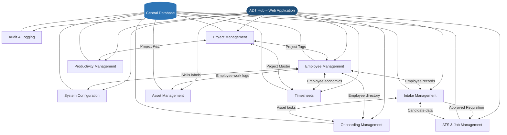

Each module also supports connections to external services where relevant — such as email notifications, AI generation, and importing data from external sources — without requiring users to leave the application.

### Module Summary

| Module | Purpose | Primary Users |
|---|---|---|
| Employee Management | Central system of record for employee data, used for assignments and workflows across all modules | HR, Admins |
| System Configuration | Centralized management of global metadata, skill libraries, and dropdown lists | Admins |
| Intake Management | Capture and approve hiring requirements; auto-generate job requisitions and JDs | Recruiters, Hiring Managers, Admins |
| Onboarding Management | Orchestrate cross-team onboarding tasks for new joiners from offer acceptance to Day-1 | Recruiters, HR, IT, Admin, Hiring Managers |
| Asset Management | Register, assign, and track company assets throughout their full lifecycle | Admins, IT, HR |
| Timesheets | Track employee work hours against projects with billable/non-billable logic | Employees, Managers, Finance |
| Productivity Management | Centralized control of project P&L, employee cost structures, and margins | Admins |
| ATS & Job Management | Manage the end-to-end recruitment process from job posting to offer | Recruiters, Hiring Managers |
| Audit & Logging | System-wide tracking of user actions and record changes for compliance | Admins |
| Project Management | Operational hub for project definitions, tagging, and assignment metadata | Admins, Project Managers |

---

## Epic 1 – Personnel Management

### Overview
The Personnel Management module is the central system of record for all staff, divided into two primary business units:
1. **Employees Directory**: The management hub for active personnel records.
2. **Newly Offboarded**: A specialized workflow module for managing the decommissioning of archived staff via task-based checklists.

### Business Objectives
- Maintain a single, authoritative source of truth for all employee personnel data
- Ensure data consistency across the platform by centralizing record management
- Streamline administrative workflows by providing a searchable directory for other modules

### Employee Data Groups

| Group | Fields |
|---|---|
| **Employee Data** | Employee ID (Auto-assigned), Name, Work Email, Job Title, Dept, Manager, Status, Hire Type, Work Mode |
| **Contact Info** | Personal Email, Phone, Address & Location |
| **Emergency Contacts** | Name, Phone, and Relationship |
| **Asset Info** | **Read-only**: Asset Count (Table), Asset List (Profile); Navigation links to Asset Module (Epic 5) |
| **Project Tracking** | Active Projects (Tags); **Project History**: Historical assignments with roles/dates (Editable in Profile) |
| **Attachments** | Employment contracts, IDs, Certifications, and other documents (Upload/View/Download) |

### Project Tagging Architecture (Smart Assignment)

When an employee is tagged to a project in the creation modal or profile, the system leverages **Epic 8 (Project Management)**:
- **Project Lookup**: Searchable master list from Epic 8.
- **Inline Creation Flow**:
    - **Inheritance**: Selecting "Create New" inherits the text currently typed in the search field as the project name.
    - **Input Clearing**: Upon selection, the search/tag field (the "project field") is cleared immediately to allow for subsequent searches, and the name is transferred to the newly expanded project details section.
    - **Atomic Save**: New project entries are only persisted to the database (Epic 8) upon the final "Save" of the employee record. If the modal or edits are canceled, no project record is created.
- **Metadata per Tag**: For each project assigned, a distinct section expands to capture:
    - **Project Role**: Specific role on this project (source: Epic 8 / custom).
- **Management**: Users can delete tags or **collapse** expanded sections (via a toggle/button next to each entry) directly from the UI.

### Scope
**In Scope**
- Employee master record creation and management (HR/Admin only)
- Centralized employee directory available to other modules
- Tracking of comprehensive employment details (as defined in Data Groups)
- Emergency contact and relationship management
- **Project Tracking**: Multi-tag assignment of employees to active and historical projects

**Out of Scope**
- Employee self-service portals
- Performance management or payroll
- AI-driven skills intelligence (Managed via Intake/Recruitment modules)
- Talent/gap analysis (Advanced AI beyond basic search)

### User Flow


### Key Features (Priority-Based)

| ID | Feature | Priority | Data Captured | Data Displayed |
|---|---|---|---|---|
| **1.1** | **Employee Directory Table View** | High | Click/Navigation | **Admin Mode Toggle**: Top-level button to enable management controls; Table format (Sorted by Employee ID by default); **Actions**: View (1.4 read-only), Edit (1.4 edit mode), Audit (9.1 - Red in Admin Mode), **Archive** (Red, visible in Admin Mode only) |
| **1.2** | **Modal-Based User Creation** | High | **All fields**; Active Projects only; Auto-assigned ID; **Initial Attachments** | "Add User" button; Popout modal; **Read-only ID preview**; **Smart Project Assignment**; **Document Upload**: Drag-and-drop or select initial employment files; Atomic save to DB |
| **1.3** | **Duplicate Detection Logic** | High | Work Email, Personal Email, Employee ID | **Real-time Validation**: Inline error indicators if unique fields are taken; **Pre-Save blocking**: Prevents submission if duplicates persist; Matches are case-insensitive and whitespace-trimmed |
| **1.4** | **Unified Employee Profile** | High | Ongoing updates to all [Employee Data Groups](#employee-data-groups); **Attachment Management** | **Management Hub**: Accessed via 1.1; View/Edit modes; **Project History Management**; **Document Center**: View, Download, or Remove existing attachments; Upload new documents with category labels; Deep-linking to Epic 5 |
| **1.5** | **Advanced Search & Filtering** | High | Multi-field search query, Sort parameters, Status (Active/Archiving/Archived) | **Unified Search Bar**: Fuzzy search across all record fields; **Filter Options Button**: Expands to show multi-group filter chips; **Header-based Filtering**: Column titles allow direct search injection; **Advanced Sorting**: ID (Num), Name (Alpha), etc.; **Status Isolation**: Active records shown by default; Archived/Archiving records excluded unless toggled via "Show Archived" filters |
| **1.6** | **Admin Mode & Bulk Management** | High | Multi-selection set, File Upload (Import) | **Admin Mode UI**: Gradually shifting toggle reveals **Actions** (Dropdown) and **Export** (Stand-alone button); **Checklist Selection**: Left-side column; **Actions Menu**: Assign to Project, Archive, **Bulk Import** (Always enabled); **Export Button**: Exports selected or all (PDF/CSV); **Import Results View**: Discards current search; **Safety Guards**: All actions require a confirmation popup before processing |
| **1.7** | **System-Wide Referencing** | High | N/A (Data lookup via DB keys) | Selection dropdowns in other modules (Assets, ATS, etc.) using central DB keys |
| **1.8** | **Admin-Only Row Controls** | High | UI Toggle State | Row-level buttons (Archive, Audit) highlighted in **Red**; Only visible when Admin Mode is active |
| **1.9** | **Archived User Lifecycle** | High | Decommissioning checks, Project migration | **Workflow Integration**: Initial archiving sets status to **Archiving** and moves users to the "Newly Offboarded" sub-module; Final completion sets status to **Archived** |
| **1.10** | **Newly Offboarded (Offboarding Hub)** | High | Task status, Sign-off logs, Assignees, Deadlines | **Sub-Module View**: List of users with **Archiving** status; **Checklist Management**; **Manager Overview**: Role-specific dashboard for tracking all tasks and facilitating manual reassignment |


### Logic Contracts (Data Architecture)
- **Central Storage**: All employee records are stored in a centralized, secure relational database to ensure data integrity.
- **Duplicate Prevention Hierarchy**: 
    1. **Real-time Check**: As the user tabs out (blur) of the 'Work Email', 'Personal Email', or 'Employee ID' fields, the system performs an asynchronous lookup.
    2. **Inline Feedback**: If a match is found, the field is highlighted in red with an error message: "This [Field] is already in use."
    3. **Atomic Pre-submission Check**: A final check is performed on the server-side during the 'Save' transaction to prevent race conditions.
    4. **Matching Rules**: All unique field checks are case-insensitive and follow strict whitespace trimming.
- **Search & Filter Architecture**:
    - **Unified Search**: A single input searches all record fields (ID, Name, Role, etc.) for partial matches.
    - **Filter Logic**: A dedicated "Filter" button expands to reveal selection chips for Dept, Location, and Project.
    - **Contextual Search**: Clicking a column header in the table (1.1) automatically populates the search/filter criteria with that specific field's value.
    - **Sorting**: Toggle buttons next to the search bar allow for numeric (ID) and alphabetical (Name/Dept) sorting in ascending/descending order.
    - **Status Isolation**: Employees marked as **Archiving** or **Archived** are hidden from all default views, searches, and filters.
    - **Filtered Discovery**: A specialized "Show Non-Active" filter allows users to toggle between **Archiving** (Pending checks) and **Archived** (Closed/Decommissioned) records in the directory results.
    - **Deep Table Persistence**: The system caches the search query, active filter list, sort state, and **scroll position**. Navigating back from a profile (1.4) restores the table to its exact previous state.
- **System-Wide Referencing (Feature 1.7)**:
    - **Authoritative Source**: Epic 1 is the sole owner of employee identity. Modules (Assets, ATS, etc.) must reference the **Employee ID** (Primary Key) and never store duplicate PII (Name/Email) locally.
    - **Real-Time Lookup**: Other modules pull display names and contact info dynamically via the API to ensure they always reflect the latest updates from the Directory.
    - **Status Enforcement**: Modules must respect the employee status. Users with **Archiving** or **Archived** status are automatically excluded from "New Assignment" dropdowns (e.g., cannot assign a new Asset or a new Job Stakeholder role to an offboarded user).
    - **Global Traceability**: Clicking an Employee Name in any other module (e.g., Asset Owner in Epic 5) deep-links the user back to the **Unified Employee Profile (1.4)** for full context.
- **Immutable Records & Archiving**: Employee records cannot be permanently deleted from the system. Instead, they are moved to an 'Archive' state. Permanent removal is only possible via a specialized Admin Settings panel.
- **Auto-Incrementing IDs**: The system generates unique, incrementing Employee IDs for every new record created, ensuring no gaps or duplicates in the identification sequence. In the creation modal, this ID is displayed as a **read-only preview** and cannot be modified by the user.
- **Audit Integration**: The "View Audit" action in the directory table links to the Audit Module (Epic 9), automatically applying a filter for the selected user's history (Visible to Admins only).
- **Metadata Source**: Dropdown selections (Dept, Location, Hire Type, etc.) are managed via the **System Configuration (Epic 2)** to ensure global consistency.
- **Project Atomic Save**: Inline project creation within the employee modal is treated as a single transaction; projects are not added to the master table unless the employee record is successfully saved.
- **Asset Integration Logic**: 
    - **Read-Only**: Asset data (Count/List) is strictly read-only within Epic 1. No asset assignment or editing can occur in the Employee Creation or Profile screens.
    - **Epic 5 Authority**: All asset movements (assign/remove) must be performed within the **Asset Management (Epic 5)** module.
    - **Deep-Linking**: Clicking a specific asset in the profile (1.4) redirects the user to Epic 5 and automatically initiates a search for that asset's unique ID for immediate inspection.
- **Admin Mode Operations**:
    - **Configurable Access**: The visibility of the "Admin Mode" toggle and specific buttons (Actions/Export) is controlled by **Role Permissions** defined in Epic 2. This allows HR or other custom roles to be granted administrative editing/bulk powers.
    - **Toggle UI**: Toggling "Admin Mode" initiates a gradual visual shift revealing the **Actions** dropdown and a separate **Export** button. Toggling OFF hides these and row-level admin controls.
    - **Selection Logic**: The selection column is only visible in Admin Mode. Toggling OFF retains current selection (cached).
    - **Action States**: "Actions" menu (except Bulk Import) and "Export" button are greyed out until at least one user is selected.
    - **Row-Level Admin**: When Admin Mode is active, an **Archive** button (Red) appears in the row-level action menu alongside Audit (Red). These are hidden when toggled OFF.
    - **Smart Export**: Stand-alone button next to Actions; exports selected users or all (if 0 or all selected) to PDF/CSV.
    - **Action Confirmations**: Any administrative action (Single/Bulk Archive, Project Assignment, **Password Reset**) triggers a **confirmation popup** ("Are you sure you want to [Action] [N] users?") to prevent accidental errors.
    - **Bulk Import Behavior**: Unified under the Actions menu (always enabled). Upon successful import, the system **disregards current search/filters** and updates the table to display only the newly imported records for immediate verification.
    - **Bulk Import Mapping**: Includes a smart-matching step to link CSV/Excel headers to internal fields.
    - **Permanent Deletion**: Controlled via a specific override within the Admin Actions set, requiring re-authentication and audit logging.
- **Draft Persistence**: If a user accidentally closes the creation modal (e.g., clicking the background overlay), all current input data is temporarily cached. Reopening the modal restores the previous session state.
- **Archived User Workflow (Lifecycle)**:
    - **Discovery**: Archived users are hidden by default. Access is managed via a "Show Archived" filter within the Advanced Filtering (1.5) system.
    - **Email Decommissioning**: The archiving process includes a mandatory checklist for administrators to verify "Work Email Decommissioned."
    - **Project Cleanup**: Upon archiving, the system automatically removes the employee from all **Active Project Tags** and creates corresponding entries in their **Project History** section (storing last role and exit date).
    - **Historical Integrity**: Archived records remain searchable (when filtered) to maintain audit trails for past project assignments and asset custodianship.
- **Project History Management**:
    - **Editable History**: Administrators can manually add, edit, or remove entries in the "Project History" section within the Employee Profile (1.4) to correct past assignment records.
    - **Admin Mode Account Actions**: When in Admin Mode, the Profile "Action Menu" reveals **"Reset Password"**, **"Detach 2FA Linkage"**, and **"Lock Account"** tools.
- **2FA Status Indicator (Feature 1.4)**:
    - **Visibility**: Every employee profile shows a "Security Status" badge (e.g., **2FA: Enabled** in Green or **2FA: Disabled** in Grey).
    - **Read-Only**: This is a system-generated indicator and cannot be toggled directly by the user on the profile screen (must be reset via Action Menu).
- **Document Management (Attachments)**:
    - **Storage**: Files are stored in a secure cloud bucket (S3/Azure Blob) with links preserved in the relational database.
    - **Actions**: Users with "Edit" permissions can upload new files, rename labels, or remove attachments. All users with "View" permissions can download or preview compatible formats (PDF, JPG).
    - **Audit**: Every document upload, download, or removal is logged in the user's Audit History (Epic 9).
- **Navigation Guard**: System triggers a standard browser confirmation dialog if the user attempts to reload or navigate away from the page while the creation modal has unsaved changes.
- **Role-Based Access Control (RBAC)**:
    - **Epic 2 Authority**: The "who" (which roles) can access Admin Mode or edit records is managed exclusively in the **System Configuration (Epic 2)** module.
    - **PII Masking**: Sensitive data visibility is controlled via the role-based toggles defined in Epic 2.
- **Offboarding & Task Pool Operations (Feature 1.10)**:
    - **Gradual Archival**: When an admin initiates an "Archive" action, the user record status shifts from **Active** to **Archiving**. They are moved to the **Newly Offboarded** sub-module and remain there until all checks are resolved.
    - **Mandatory Checks**:
        1. **Work Email Decommissioning** (Assigned to **IT** role).
        2. **Project History Migration** (Automated; verified by Manager).
        3. **Asset Retrieval** (Assigned to **HR/Asset Manager**; linked to Epic 5).
        4. **System Account Removal** (GitHub/Microsoft) (Assigned to **IT** role).
    - **The Task Pool**:
        - Tasks are not assigned to individuals initially but are instead pooled by **Role** (e.g., all IT users see pending email checks).
        - **Self-Assignment**: Users can "Pick up" a task from the pool, becoming the primary assignee.
        - **Sign-off**: Marking a check as resolved logs the specific user's ID and timestamp to the employee record and the **Audit Module (Epic 9)**.
    - **Deadline & Escalation Logic**:
        - **Task Deadlines**: Every offboarding check has a system-defined deadline (e.g., 72 hours from Archive initiation).
        - **Proactive Notifications**: When a task is within **24 hours of its deadline**, the system triggers a "Deadline Warning" notification to the **Assignee** and their **Manager Role**.
        - **Manager Role Oversight**:
        - **Role-Specific Dashboard**: Managers (e.g., IT Manager, HR Manager) have a specialized view within the sub-module to see **all pending and active tasks** assigned to their specific role group, regardless of the individual assignee.
        - **Manual Reassignment**: Managers can override any current assignment, reassigning a task from one role-employee to another, or "Pick up" the task themselves directly from their staff's queue.
    - **Finalization**: Only when all 4 checks are green can the user status be shifted to **Archived**. At this point, they are removed from the Newly Offboarded view and appear in the general Directory results only when the "Archived" filter is explicitly enabled.
- **Admin Mode functional logic**:
    - **Permission Check**: The "Admin Mode" toggle only appears if the user's role has the "Admin Mode Access" permission enabled in Epic 2.
    - **Action Logic**: All bulk and row-level admin actions (1.6, 1.8) are strictly gated by these central permissions.

### Roles & Permissions

| Role | Access |
|---|---|
| Admin | Full access to create, edit, and view all employee data |
| HR | Create and manage employee records |
| Employee / Manager | View-only access to the general directory (as allowed by system settings) |

### Acceptance Criteria
- **[1.1]** Authorized users can view a responsive table of employees with ID, Name, Role, Dept, Location, Manager, and Work Email, sorted by ID by default.
- **[1.1]** Admins can click "View Audit" to navigate to the Audit module with pre-filtered user history.
- **[1.2]** HR and Admins can trigger an "Add User" popout modal from the Table View page.
- **[1.2]** Clicking "Add New User" within the modal accurately persists all data points to the database.
- **[1.3]** System prevents record creation and displays a clear error if a duplicate Work Email, Personal Email, or Employee ID is detected.
- **[1.4]** Once created/viewed, employee profiles accurately display all grouped information and current asset status.
- **[1.5]** Users can perform natural language searches and apply multi-dimensional filters (Dept, Role, etc.) to the directory.
- **[1.6]** Authorized users can access a centralized directory summary for personnel verification.
- **[1.7]** Employee records are selectable as primary data points (e.g., as Asset Custodians or Hiring Managers) in all downstream modules using secure database referencing.
- **[1.8]** Data integrity is maintained through strict RBAC, ensuring only authorized personnel can add or modify master records.

### Success Metrics
- 100% of staff accurately represented in the system of record
- Zero data silos between employee records and asset assignments
- Reduction in manual data entry when initiating onboarding workflows

---

## Epic 2 – Admin Systems Settings

### Overview
The Admin Systems Settings module is a master control center for ADT Hub. It is organized into specialized sub-modules to manage global metadata, security, and system-wide automation. This ensures that every module in the Hub operates from a single, consistent source of configuration.

### Sub-Modules & Features

| ID | Sub-Module | Feature | Priority | Data / Controls |
|---|---|---|---|---|
| **2.1** | **Dropdown Settings** | **Area-Specific Sub-Sub-Modules** | High | **Hierarchical Management**: Nested container for area-specific lists. <br>• **Employees**: Dept, Location, Role Levels, Hire Types. <br>• **Intake**: Requisition Statuses, Reason for Hire, Hiring Priorities. <br>• **Onboarding**: Task Categories, Provisioning Stages. <br>• **Assets**: Category, Manufacturer, Status, Condition. <br>• **Audit & Logging**: Event Severity, Log Categories. |
| **2.2** | **Skill Management** | **Skill Repository** | Medium | **Automated Library**: Dynamic repository of all skills. <br>• **Admin Tools**: Bulk select to delete; usage tracking (Intake counts). <br>• **Performance**: Paginated grid; fuzzy search; sort by **Date Added**. <br>• **Auto-Host**: Staged skills from Intake persist on save. |
| **2.3** | **Role & Permission Management** | **Additive Role System** | High | **Role Repository**: Centralized creation and management of all system roles. <br>• **Permission Mapping**: Define action and visibility rights. <br>• **Assignment Hierarchy**: Define which roles can assign other roles (e.g., HR can assign 'Staff' but not 'Admin'). |
| **2.4** | **Notification Module** | **Communication Hub** | Medium | **System Master Switches**: Global and module-specific toggles for Email/In-App alerts. <br>• **Threshold Management**: Centralized control for task deadlines and escalation timing. |
| **2.5** | **Audit Settings** | **Governance & Compliance** | Low | **Retention Rules**: Global log storage durations. <br>• **Log Integrity**: Read-only enforcement; Export for external audits. |
| **2.6** | **System Security** | **Advanced Protection** | High | **Approval Gates**: "Block & Approve" for high-risk actions. <br>• **Snapshots**: Immutable 7-day backups with Selective Restore. |

### Logic Contracts (System Administration)
- **Three-Tier Hierarchy**: The UI reflects a **Module (Settings) > Sub-Module (Dropdowns) > Sub-Sub-Module (Area)** navigation pattern.
- **Dropdown Authority (Feature 2.1)**: 
    - **Sole Source of Truth**: These sub-sub-modules are the **only** locations where dropdown values for their respective areas (Employees, Intake, etc.) can be added, edited, or removed.
    - **Consumer Enforcement**: Other modules (e.g., Epic 1 creation modal) are strictly prohibited from using hardcoded lists or locally-stored options; they must fetch data dynamically from these settings.
    - **Global Rename Propagation**: Renaming an entry in any sub-sub-module dropdown list updates all records referencing that ID across the entire database instantly.
- **Skill Management (Feature 2.2)**: 
    - **Atomic Persistence**: New skills created on-the-fly in the Intake module (Epic 3) or Onboarding module (Epic 4) are **staged** locally during the session. They are only permanently added to the master database upon a successful "Save" of the parent record.
    - **Discard Logic**: If an intake or onboarding record is canceled or discarded before saving, any "New" skill tags created within that session are automatically purged.
    - **Smart Lookup & Mapping**: The system maintains a mapping layer for common abbreviations. If a user types "JS", the system proactively suggests "Javascript" as the primary tag while allowing the user to explicitly "Create New" if they have a distinct requirement.
    - **Admin Bulk Actions**: Admins can bulk-select tags to delete or merge. To prevent data loss, the system displays a **Usage Count** (how many Intakes/Profiles use this tag) upon selection.
    - **Search & Filtering**: The repository includes a fuzzy-search bar for finding specific tags and clickable headers to sort the library by 'Date Created' (Ascending/Descending).
    - **Performance Optimization (Pagination)**: To ensure high performance with thousands of tags, the grid implements server-side pagination with a configurable limit (e.g., 50 per page).
    - **Proficiency Removal**: Proficiency levels are explicitly out of scope for the global skill repository to maintain maximum simplicity.
    - **Role-Based Access Control (Feature 2.3)**:
    - **Sole Source of Authority**: All roles—including Employee types, Manager levels, and Admin tiers—must be created and configured **exclusively** within this sub-module.
    - **Role-as-Entity System**: Roles are treated as standardized system objects with unique IDs and specific permission payloads.
    - **Manager Role Attribution**: Admins can flag a role as a **"Manager Type."**
        - **Departmental Linking**: Manager roles can be linked to a specific **Department** (e.g., "IT Manager" is linked to the "Information Technology" department).
        - **Authoritative Scoping**: This link is used by other modules to identify the "Manager of Record" for departmental approvals or escalations.
    - **Multi-Role Assignment**: A single user can be assigned **multiple roles** simultaneously.
    - **Additive Permission Logic (OR Gate)**: Permissions are cumulative. If any assigned role grants a permission, the user has it.
    - **Assignment Hierarchy & Permissions**:
        - **Granting Rights**: The RBAC grid includes a section for "Role Assignment Permissions." This defines which specific roles (e.g., 'IT Support', 'Staff') a role (e.g., 'HR Manager') is allowed to assign to others.
    - **Action Permission Handling (The "Verb" Grid)**:
        - **Module Scoping (Examples)**:
            - **Employees (Personnel)**: `can_create_employee`, `can_archive_employee`, `can_edit_project_history`, `can_manage_attachments`.
            - **Asset Management**: `can_assign_asset`, `can_retire_asset`, `can_edit_asset_metadata`, `can_view_asset_valuation`.
        - **Granular Toggle**: Each role is assigned specific "Verbs" via a grid of checkboxes.
        - **Admin Mode Gating**: A critical "System Action" is the `can_access_admin_mode` toggle. If this is not checked for a role, the "Admin Mode" switch in Epic 1 remains hidden/disabled for that user.
        - **Backend Enforcement**: Each API request checks the user's active role(s) for the specific action key. If the key is missing from all assigned roles, the request is rejected before data processing.
    - **Visibility Toggle Handling (The "Noun" Grid)**:
        - **PII Shielding**: Visibility is handled via "Data Scopes." Roles can be toggled to "Reveal PII," "Reveal Financials," or "Reveal Audit Trails." Without these, fields appear as masked (asterisks) or the entire column/section is hidden.
- **Notification Central (Feature 2.4)**:
    - **Hierarchy of Control**:
        - **Global Kill-Switch**: A master toggle to disable all outgoing communications (Email/In-App).
        - **Module & Role Toggles**: Admins assign triggers to **Roles (2.3)**.
        - **Notification Channels**: For each trigger, the system allows selecting **"My Tasks" (In-App)**, **"Work Email"**, or **"Both"**.
        - **Email Enforcement**: All external alerts are strictly routed to the user's **Work Email Address** as stored in their Employee Profile.
    - **Notification Scoping (Anti-Fatigue)**:
        - **Role-Wide Alerts**: Broad alerts (e.g., "New Intake Created") are sent to all users with the assigned Role.
        - **Assignment-Specific Alerts**: For task-based modules (e.g., Offboarding tasks), notifications are **only** sent to the specific user assigned to that task, even if multiple users hold the same functional role.
    - **Timing & Thresholds**:
        - **Dynamic Deadlines**: Set standard task durations (e.g., 72hr Offboarding).
        - **Departmental Escalation Triggers**: Escalation alerts are routed using the **Departmental Link** from Epic 2.3.
            - **Scoped Routing**: If an IT-specific task misses a deadline, the escalation notification is sent **only** to the role(s) defined as the "Manager" of the "IT" department. This prevents managers in unrelated departments (e.g., HR) from receiving irrelevant alerts.
    - **Role-Based Routing**: Notifications are mapped to **Roles**, ensuring "My Tasks" feeds and email alerts synchronize automatically with role changes.
- **Audit & Governance (Feature 2.5)**:
    - **Retention Policy**: Admins set the "Shelf Life" for system logs (e.g., 90 days, 1 year, or Infinite). 
    - **Retention Change Grace Period**: 
        - **Logic**: Any change to the retention policy that would result in log deletion triggers a mandatory **7-day Grace Period**.
        - **Data Preservation**: Logs that exceed the *new* limit but were valid under the *old* limit (or are within 7 days of the new limit) are protected from the automated purge for exactly **168 hours (7 days)**.
        - **Recovery Window**: This provides a "Safety Buffer" to revert the retention change if it was made in error or by a bad actor before any data is permanently erased.
    - **Immutable Logs**: Once an audit event is recorded, it cannot be edited or deleted by any user account. Entries are only removed by the automated retention purge (after the grace period).
    - **Export for Compliance**: Admins can generate signed PDF or CSV exports of audit trails specifically for external compliance reviews.
- **System Security (Feature 2.6)**:
    - **Daily Snapshot Rotation**:
        - **Automatic Cycle**: The system generates a full database snapshot once every 24 hours.
        - **3-Day Retention**: Standard snapshots are automatically deleted after **72 hours (3 days)** to optimize storage.
    - **Security Triggers (Gated Actions)**:
        - **Category 1: Nuclear Reset Triggers (Lockdown + Gate)**:
            - **Triggers**: Attempted deletion of **all data** for primary modules (Employees, Intake, Onboarding, Assets, Projects, Audit Logs).
            - **Lockdown Behavior**: Upon trigger, the **most recent daily snapshot** is immediately "Promoted" to a **7-Day Lockdown** status.
            - **Immutable Lockdown**: Once promoted, the snapshot cannot be deleted or modified for 168 hours (7 days), even by System Admins.
        - **Category 2: Critical Management Triggers (Gate Only)**:
            - **Triggers**: 
                - **Bulk Archiving**: >10 employees in a single transaction.
                - **Velocity Purge**: 10 separate employee archiving actions within a 1-hour rolling window.
                - **Structural Changes**: Deleting a System Role or Modifying Audit Retention.
                - **Account Security**: Detaching User 2FA, Suspicious individual password resets.
            - **Behavior**: System **blocks the action** and alerts System Admins for manual approval. Does not trigger a 7-day snapshot lockdown.
    - **Sealed Storage**: All snapshots (Daily and Locked) are stored in a restricted volume; they cannot be moved, copied, downloaded, or exported to prevent external exploitation.
    - **Surgical Restore Wizard**:
        - **Restore Source**: Uses the 7-Day Locked Snapshot to revert the system.
        - **Non-Destructive Merge**: The wizard allows Admins to "Roll Back" specific compromised records while **expressly preserving** all new data, projects, or employees created after the snapshot was taken.
    - **Admin Oversight**: All Category 1 & 2 actions trigger a **Priority 1 Alert**. Changes are only committed upon explicit Admin approval in the Security Dashboard.
    - **Account Infrastructure**:
        - **Password Storage**: All passwords must be salted and hashed using industry-standard algorithms (e.g., Argon2 or BCrypt). The live database never stores cleartext passwords.
        - **2FA Linkage**:
            - **Provider Agnostic**: The system supports linkage to TOTP (Authenticator Apps) or SMS/Email-based 2FA.
            - **Mandatory Gating**: Admins can enforce "Mandatory 2FA" for specific high-privilege roles (defined in 2.3).
            - **Reset Logic**: 2FA resets follow the same "Approval Gate" as high-risk actions to prevent account takeovers via social engineering.
- **Deduplication Logic**: System blocks duplicate entries in metadata and skill lists to prevent "Data Drift" (e.g., prevents having both "NYC" and "New York City" as locations).

---

---

## Epic 3 – Intake Management

### Overview
The Intake Management module is a dedicated section of the ADT Hub web application and serves as the starting point of the hiring lifecycle. It allows recruiters to capture structured hiring information through an online form and automatically generates a Job Requisition and a draft Job Description upon approval. Data entered here is stored centrally and connects to the Employee Management module for skills data.

### Business Objectives
- Reduce time to create and approve job requisitions
- Improve quality and consistency of job descriptions
- Create a single source of truth for hiring requirements
- Enable scalable hiring processes as the organisation grows

### Scope
**In Scope**
- Intake form creation and management
- Structured data capture (budget, location, skills, role level, employment type, business context)
- Skill tagging with smart label creation and reuse
- Validation of mandatory fields
- Conversion of intake into Job Requisition
- AI-assisted JD generation based on intake data and existing JD formats
- AI-generated intake summary saved to the intake record and emailed to hiring managers
- Status tracking: Draft → Submitted → Approved → Converted

### Key Features (Priority-Based)

| ID | Feature | Priority | Data Captured | Data Displayed |
|---|---|---|---|---|
| **3.1** | **Configurable Intake Form** | High | Hiring Manager, Job Title, Dept, Openings, Budget, Location, Employment Type, Reason for Hire, Role Level, Key Responsibilities, Hiring Priority | Form summary, Validation status, Approval status |
| **3.2** | **Skill Tagging** | Medium | Skill name (search/create), Proficiency level | Skill labels, Global skill library indicators |
| **3.3** | **Approval Workflow** | High | Approver selection, Approval/Rejection comments | Status (Draft → Submitted → Approved), Approval history |
| **3.4** | **AI JD Generation** | Medium | Tone/Style preferences (optional) | Draft Job Description content |
| **3.5** | **AI Intake Summary** | Medium | N/A (Generated from 3.1) | Contextual summary, Hiring Manager email preview |
| **3.6** | **Audit Trail** | Low | N/A (System log) | Change log (Who/When/What), Prior versions |
| **3.7** | **Handoff to ATS** | High | Target Job Requisition settings | Link to generated Job Req, Handoff timestamp |
| **3.8** | **Role-Based Access** | High | User permissions configuration | User-specific view/edit permissions |

### Skill Tagging – Behaviour (Atomic Persistence)
```mermaid
flowchart TD
    A([Recruiter Types a Skill]) --> B{Skill Exists in Library?}
    B -- Yes --> C[Matching Labels Shown as Suggestions]
    C --> D[Recruiter Selects Label]
    D --> E([Tag Added to Intake])
    B -- No --> F[Option to Create New Skill Label]
    F --> G[New Label Staged in Current Session]
    G --> E
    E --> H{Is Intake Saved / Approved?}
    H -- Yes --> I[New Skills Persisted to Global Library (2.2)]
    H -- No/Cancel --> J[New Skills Discarded]
    I --> K[Label Searchable & Reusable on Future Intakes]

    style A fill:#1F4E79,color:#fff,stroke:none
    style E fill:#1F4E79,color:#fff,stroke:none
    style G fill:#2E75B6,color:#fff,stroke:none
    style I fill:#2E75B6,color:#fff,stroke:none
```

### AI Intake Summary – Flow
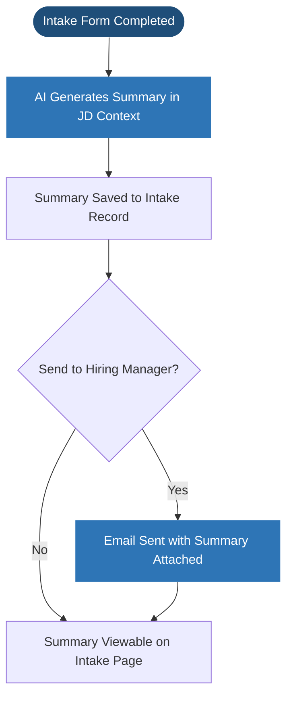

### User Flow
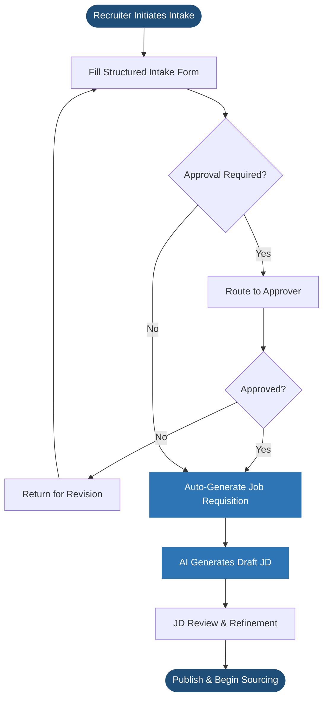

### Status Lifecycle
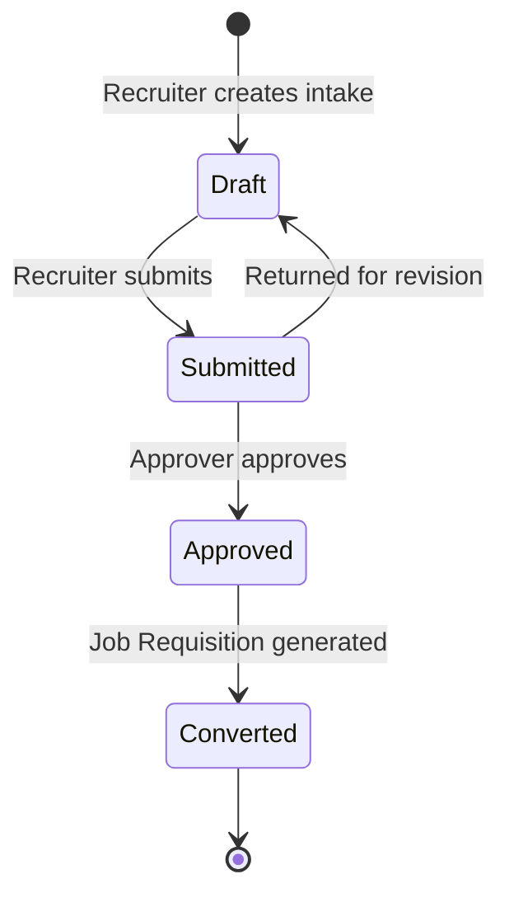

### Acceptance Criteria
- **[3.1]** Recruiters can create and submit a complete intake form with all required data fields
- **[3.1]** Mandatory fields are validated before submission
- **[3.2]** Skills can be typed and matched against the existing label library; new labels can be created and are immediately available for reuse
- **[3.2]** All skill labels are searchable and filterable across intake records
- **[3.3]** Approval workflow routes intake to the correct approver (where configured)
- **[3.7]** Job Requisition is auto-created upon approval (Handoff to ATS)
- **[3.4]** Draft JD is generated in the existing organisation format using AI
- **[3.5]** AI-generated intake summary is saved to the intake record
- **[3.5]** Summary can be emailed to the hiring manager directly from the intake
- **[3.6]** All intake records include a full audit trail and version history

---

## Epic 4 – Onboarding Management

### Business Objectives

- Ensure consistent and error-free onboarding for every new joiner
- Reduce Day-1 productivity gaps caused by incomplete setup
- Eliminate manual coordination and follow-up across teams
- Provide real-time visibility and accountability across all onboarding tasks
- Scale onboarding efficiently as hiring volume increases

### Scope

**In Scope**
- Onboarding workflow initiation from offer/joining confirmation
- Task and dependent task orchestration across teams
- Cross-team task ownership and assignment
- Configurable onboarding templates defining tasks, owners, dependencies, and notifications
- Status tracking and SLA monitoring
- Automated notifications and reminders
- Central onboarding dashboard for all stakeholders

**Out of Scope**
- Offboarding workflows
- Payroll processing
- Performance management
- Learning and development content delivery

### User Flow


### Task Dependency Map


### Key Features (Priority-Based)

| ID | Feature | Priority | Data Captured | Data Displayed |
|---|---|---|---|---|
| **4.1** | **Workflow Template Builder** | High | Template name, Tasks, Assigned teams, Due rules, Dependencies, Notifications | Template configuration list, Node-based workflow preview |
| **4.2** | **Template Versioning** | Medium | N/A (Auto-versioning) | Version history, "Active" vs "Draft" status |
| **4.3** | **Task Dependency Management** | High | Dependency mapping (Task A depends on Task B) | Visual dependency tree, Locked/Unlocked task states |
| **4.4** | **Multi-Team Assignment** | High | Target team (IT, HR, Admin, etc.) | Team-specific task counts, Overdue items by team |
| **4.5** | **SLA Enforcement** | Medium | Target completion datetime | SLA countdown, Overdue escalation status |
| **4.6** | **Real-Time Dashboard** | High | N/A (Aggregated data) | Progress percentage per joiner, Global onboarding health |
| **4.7** | **Audit Trail** | Low | N/A (System log) | Timestamped task completions, Ownership changes |

### Template Structure

Each onboarding template defines:

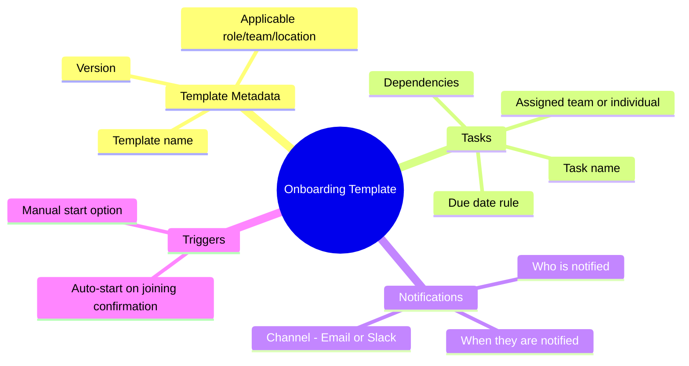

### Roles & Permissions

| Role | Access |
|---|---|
| Admin | Configure workflows, templates, and task dependencies |
| Recruiter | Initiate onboarding and track overall progress |
| Task Owner (IT/HR/Admin) | View and complete assigned tasks |
| Hiring Manager | View onboarding status for their new joiners |

### Acceptance Criteria
- **[4.1]** Admins can create and edit onboarding templates with complex rules (tasks, owners, due dates).
- **[4.2]** System supports template versioning, ensuring ongoing processes are not interrupted by updates.
- **[4.3]** Tasks are correctly gated by dependencies, only becoming active/notified once prerequisites are met.
- **[4.4]** Tasks are automatically assigned and distributed to the correct cross-functional teams.
- **[4.5]** SLA monitoring triggers notifications and visual flags for overdue onboarding items.
- **[4.6]** Stakeholders can access a real-time dashboard showing the status of all active new joiners.
- **[4.7]** Full audit logs capture every change in task status and template configuration.

### Success Metrics

- % of onboarding tasks completed before Day-1
- Reduction in onboarding delays
- Average onboarding completion time
- New joiner satisfaction score
- Reduction in manual follow-ups by recruiters

---

## Epic 5 – Asset Management

### Overview

The Asset Management module is a dedicated section of the ADT Hub web application and acts as the system of record for all company-owned assets. Admins can register assets, assign them to employees using data from the Employee Management module, and track their full lifecycle. The module also supports importing asset data from external sources and attaching invoices for verification, with all records stored centrally and linked to employee profiles.

### Business Objectives

- Maintain a single, reliable source of truth for all company assets
- Ensure complete asset traceability and audit compliance
- Reduce asset loss and mismanagement
- Enable proactive warranty and replacement planning
- Improve onboarding efficiency through faster asset assignment

### Scope

**In Scope**
- Asset registration and master data management
- Asset assignment and reassignment via Employee Management integration
- Dedicated asset detail page per asset record
- Immutable asset records (non-deletable; status changes only)
- Search and filter across all asset records
- Automated warranty expiry notifications
- Bulk asset import from external data sources with configurable field-matching criteria
- Invoice attachment and asset-to-invoice verification

**Out of Scope**
- Asset procurement workflows and vendor payments
- Asset depreciation and accounting
- Asset disposal approval workflows

### Asset Lifecycle

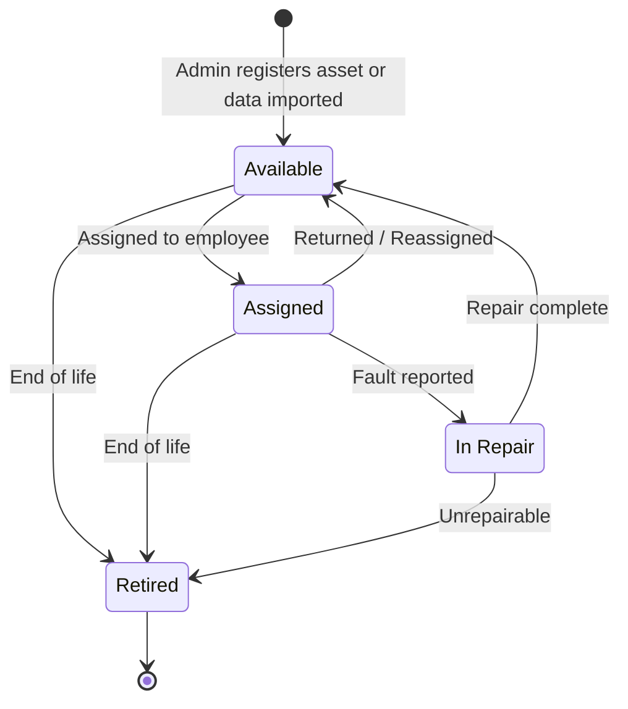

### Warranty Alert Flow


### Key Features (Priority-Based)

| ID | Feature | Priority | Data Captured | Data Displayed |
|---|---|---|---|---|
| **5.1** | **Asset Registration** | High | Category, Manufacturer, Model, Serial Number, Procurement Date, Vendor, Warranty Dates | Asset master record, Form validation status |
| **5.2** | **Asset Detail Page** | High | N/A (Aggregated data) | Full history, Status timeline, Linked invoices, Assignment history |
| **5.3** | **Employee Assignment** | High | Employee ID (Lookup), Assignment Date | Link to employee profile, Current custodian name |
| **5.4** | **Lifecycle Tracking** | High | Status transition (Available → Assigned → etc.) | Status badges, Transition history logs |
| **5.5** | **Global Search & Filters** | High | Search query, Category filter, Status filter | Filtered asset grid |
| **5.6** | **Warranty Alerts** | Medium | Alert recipient settings | Warranty expiry dashboard, Email notification preview |
| **5.7** | **Bulk Data Import** | Medium | CSV/External file, Field mapping | Import preview, Success/Failure logs per row |
| **5.8** | **Invoice Attachment** | Medium | Uploaded Invoice file, Verification notes | Attached document list, Verification status (Verified/Mismatch) |

### Employee Assignment Flow


### External Data Import Flow


**Import matching criteria are configurable by Admin** and define which fields must be present and valid for a record to be accepted into the system.

### Invoice Attachment & Verification Flow

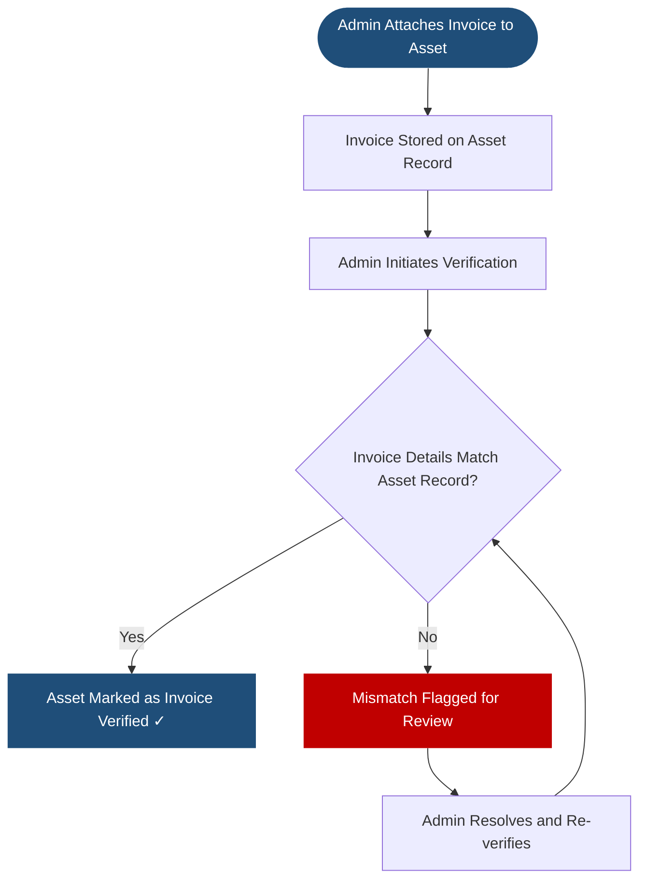

### Asset Data Captured

| Field | Details |
|---|---|
| Asset Category | Laptop, Headphones, Monitor, Peripherals, etc. |
| Manufacturer & Model | Free text |
| Serial Number / Asset Tag | Unique identifier |
| Procurement Date | Date of purchase |
| Vendor | Optional |
| Warranty Start & End Date | Used for automated alerts |
| Warranty Type | Standard / Extended |
| Current Status | Available / Assigned / In Repair / Retired |
| Assigned Employee | Linked from Employee Management directory; current and historical |
| Location | Office / Remote / Warehouse |
| Invoice Attachments | Uploaded invoices with verification status (Unverified / Verified / Mismatch) |
| Import Source | Populated if record was created via external data import; includes import date |
| Notes & Attachments | Warranty documents and general notes |

### Acceptance Criteria
- **[5.1]** Admins can create comprehensive asset records with required procurement and warranty data.
- **[5.2]** Every asset has a dedicated detail page showing its complete lifecycle and financial documentation.
- **[5.3]** Assets can be assigned to employees via a directory lookup, with immediate profile linking.
- **[5.4]** Records are immutable; status changes are tracked in a non-deletable history log.
- **[5.5]** Users can search and filter assets across all data dimensions (category, status, custodian).
- **[5.6]** Automated alerts trigger 2 months prior to warranty expiry with escalation paths.
- **[5.7]** Bulk import supports admin-defined matching criteria and provides a pre-import verification preview.
- **[5.8]** Invoices can be attached and verified against asset records, flagging any discrepancies for review.

### Success Metrics

- % of assets accurately tracked in the system
- Reduction in missing or unaccounted assets
- % of warranty expiries proactively addressed
- Reduction in onboarding delays due to asset unavailability

---

## Epic 6 – Timesheets

### Overview
A streamlined module for employees to log working hours against specific projects, ensuring accurate project costing and billable hour tracking.

### Key Features (Priority-Based)

| ID | Feature | Priority | Data Captured | Data Displayed |
|---|---|---|---|---|
| **6.1** | **Weekly Timesheet Entry** | High | Project selection, Hours per day (Mon-Sun), Notes | Weekly grid view, Total hours summary |
| **6.2** | **Billable Tracking** | High | Billable toggle per entry | Billable vs Non-billable color coding |
| **6.3** | **CSV Export** | High | Export date range | Downloadable CSV file (Finance-ready) |
| **6.4** | **Validation Rules** | High | N/A (Client-side validation) | Error messages for missing data or weekend entries |
| **6.5** | **RBAC Controls** | High | N/A (User role) | View/Edit/Delete restrictions based on role |

### Logic Contracts (from ADTHUB)
- **Current Week Calculation:** Sunday-correction logic (Sunday belongs to the ending week).
- **CSV Format:** 6-column structure: `Date, Project, Hours, Notes, Status, Employee`.

### Acceptance Criteria
- **[6.1]** Employees can log their hours against specific projects using a standard 7-day grid.
- **[6.2]** System defaults to billable but allows granular per-entry overriding.
- **[6.3]** Finance users can export a CSV that follows the exact 6-column architecture defined in the contracts.
- **[6.4]** Submission is blocked if mandatory fields (hours, projects) are missing or if weekend entries are detected.
- **[6.5]** Admins have full CRUD access to all timesheets, while employees can only modify their own draft/rejected records.

---

## Epic 7 – Productivity Management

### Overview
Build a Productivity Management module within ADT Hub that provides admins with centralized control and visibility into projects, employee cost structures, and project-level P&L by integrating project definitions, employee economics, and time-based inputs from the Timesheets module. This module serves as an admin-only financial and operational control layer.

### Business Objectives
- Provide real-time visibility into project profitability
- Enable data-driven staffing and pricing decisions
- Centralize project and employee commercial data
- Reduce revenue leakage and margin erosion
- Support forecasting and financial planning

### Access Control
- **Admin-only module**: No access for employees or managers outside admin roles.

### Key Features (Priority-Based)

| ID | Feature | Priority | Data Captured | Data Displayed |
|---|---|---|---|---|
| **7.1** | **Project Definition & Management** | High | Project Name, Client, Duration, PM/Sales Manager, Discount | Master project list, Status (Planned/Active/Closed) |
| **7.2** | **Employee Commercial data** | High | Employee, Location, Annual Cost, Margin %, Local/Base Rates | Employee commercial grid, Multi-currency cost views |
| **7.3** | **Project P&L Tracking** | High | Role assignments, Billable/Base Rates, Effective dates | Projected Revenue, Earnings (Before Tax), Margin % |
| **7.4** | **Timesheet Integration** | High | N/A (Approval status in Epic 6) | Revenue/Cost calculations based on approved hours |

### Timesheets Integration (Dependency)
- Actual time spent is sourced from the **Timesheets** module.
- **Projected Revenue** = Bill Rate × Approved Billable Hours.
- Earnings calculations are updated as timesheet data changes.
- Supports period-based (weekly/monthly) roll-ups.

### High-Level User Flow
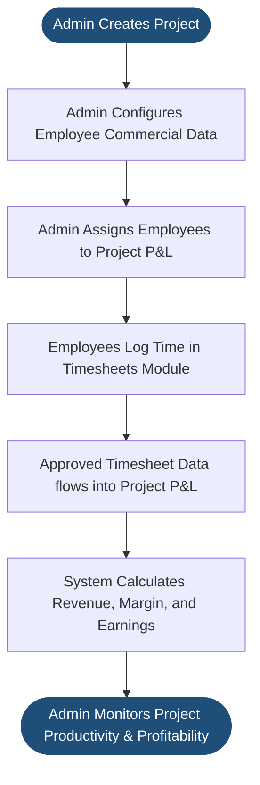

### Key Calculations
- **Projected Revenue** = Bill Rate × Billable Hours (from Timesheets)
- **Base Cost** = Base Rate × Billable Hours
- **Project Margin %** = (Revenue – Cost) / Revenue
- **Projected Earnings** = Revenue – Cost – Discount

### Acceptance Criteria
- **[7.1]** Admins can create and manage project master data with full duration and stakeholder tracking.
- **[7.2]** System maintains a specialized commercial view for employees, supporting multi-currency and historic rate tracking.
- **[7.3]** Project P&L accurately displays projected vs. actual revenue and margin based on effective date rules.
- **[7.4]** Approved timesheet hours flow linearly into Productivity calculators without manual re-entry.
- **[7.3]** All financial and margin calculations are auditable and restricted to users with Admin roles.

### Audit & Compliance
- Historical rate and margin changes are retained.
- Effective date tracking for P&L records.
- All financial edits are logged with user and timestamp.

### Dependencies
- **Timesheets module**: Approved hours required.
- **Employee master data**: Core records for commercial mapping.
- **Currency conversion service**: For multi-currency support.
- **RBAC**: Strict admin-only access.

### Success Metrics
- Accuracy of project margin reporting.
- Reduction in manual P&L calculations.
- Time taken to identify low-margin projects.
- Leadership adoption of the module.

## Epic 8 – Project Management

### Overview
The Project Management module is the operational engine for defining and tracking projects across ADT Hub. While the Productivity module focuses on financial P&L, this module focuses on the project lifecycle, team assignments, and real-time tagging. It serves as the master source for project labels used in the Employee and Timesheet modules.

### Key Features (Priority-Based)

| ID | Feature | Priority | Data Captured | Data Displayed |
|---|---|---|---|---|
| **8.1** | **Project Master Table** | High | Project Name, Client, Category, Status, Description | Searchable list of all projects; Edit/View actions |
| **8.2** | **Project Creation Popout** | High | Name, Client, Internal Lead, Start Date | Compact form for inline creation (linked to Epic 1) |
| **8.3** | **Team Assignment View** | Medium | N/A (Linked from Epic 1) | Aggregated list of all employees tagged to a specific project |
| **8.4** | **Project Status Tracking** | Medium | Status (Pipeline → Active → Completed → Cancelled) | Visual status badges; Timeline of status changes |
| **8.5** | **Tag Management** | High | Tag color, Category labels | Global project tag library; Usage counts |

### Smart Assignment Flow (Cross-Module)
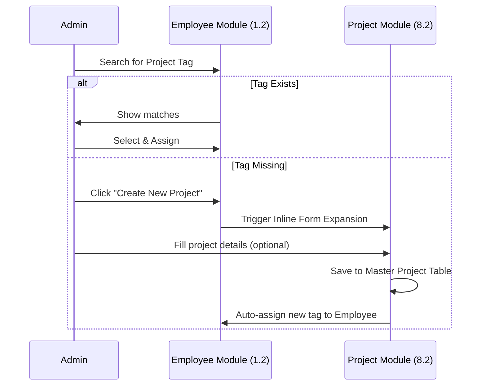

### Acceptance Criteria
- **[8.1]** Admins can manage a master list of all projects with full operational details.
- **[8.2]** The module provides a lightweight endpoint for inline project creation within other modules.
- **[8.3]** Users can view a "Project Team" list showing everyone currently assigned to a project tag.
- **[8.4]** Projects can be transitioned through a standard lifecycle with status history.
- **[8.5]** Project tags support custom styling (colors) to easily distinguish between categories.

---

## Epic 9 – Audit & Logging

### Overview
System-wide tracking of user actions and record changes for compliance.

---

## Epic 10 – ATS & Job Management

### Overview
This module is the operational engine for the hiring process, taking approved Job Requisitions from the Intake Management module and transforming them into active job vacancies. It focuses on tracking the status of these jobs and managing candidates through the recruitment funnel.

### Key Features (Priority-Based)

| ID | Feature | Priority | Data Captured | Data Displayed |
|---|---|---|---|---|
| **10.1** | **Job Requisition Hub** | High | Requisition status updates | List of requisitions, status indicators (Draft, Active, etc.) |
| **10.2** | **Vacancy Tracking** | High | Hiring Manager, Budget, Priority (inherited), Posting dates | Vacancy details, Priority level, Days open |
| **10.3** | **AI Resume Parsing** | Medium | Uploaded CV/Resume file | Candidate Name, Email, Phone, LinkedIn profile, Parsed skills |
| **10.4** | **Candidate Kanban** | High | Candidate stage (Drag-and-drop) | Candidate cards by stage, Total count per stage |
| **10.5** | **Advanced Filtering** | Medium | Filter criteria (Skills, Proficiency, Location) | Filtered list of candidates |
| **10.6** | **Interview Feedback** | Medium | Interviewer name, Rating (1-5), Qualitative comments | Feedback history, Average rating per candidate |

### Job Lifecycle
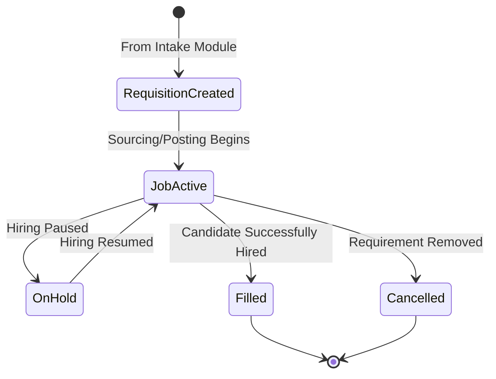

### Logic Contracts (from ADTHUB)
- **Data Inheritance:** All vacancy records must inherit `Budget`, `Role Level`, and `Skills Tags` directly from the approved Intake record.
- **Name Extraction:** Multi-strategy fallback (Line 1-5, Title Case check, ALL CAPS normalisation, Email local-part derivation).
- **Phone Extraction:** Supports international formats, 10-digit US, and parentheses while excluding years (e.g., "2024").

### Acceptance Criteria
- **[10.1]** Users can view a centralized hub of all job requisitions with correct status mapping.
- **[10.2]** Vacancy records accurately inherit data from the Intake module and allow for priority tracking.
- **[10.3]** AI parsing correctly extracts contact information and professional links from standard CV formats.
- **[10.4]** Recruiters can move candidates between stages via drag-and-drop, with immediate state persistence.
- **[10.5]** Advanced searches accurately filter the candidate pool based on skill tags and proficiency levels.
- **[10.6]** Interviewers can submit structured feedback that is immediately viewable on the candidate's profile.

---

## Appendix – Cross-Module Connections

Each module in ADT Hub is a webpage within the same web application. They share a central database and reference each other's data where relevant. The diagram below shows the key connections between modules and the external services the application relies on.

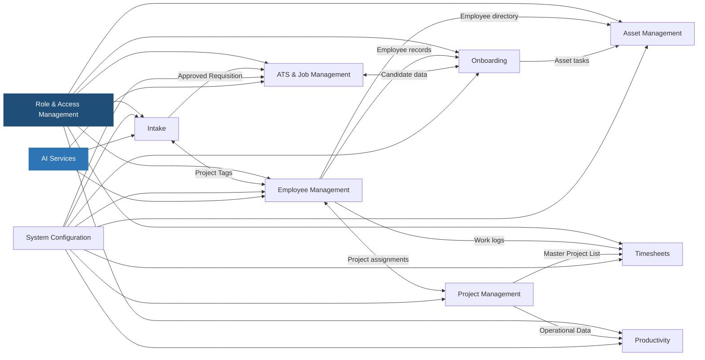

| Module | Connected To | How They Connect |
|---|---|---|
| Employee Management | All Modules | Centralized directory and personnel records used throughout the platform |
| Intake Management | Employee Management | Skills labels from the global library are shared across both modules |
| Intake Management | ATS & Job Management | An approved intake automatically creates a Job Requisition in ATS |
| Onboarding | Employee Management | New joiner data is pulled from employee records to initiate workflows |
| Onboarding | Asset Management | Asset assignment tasks within onboarding reference the Asset module |
| Asset Management | Employee Management | Employee directory is used to search and assign assets to people |
| Timesheets | Employee Management | Employee work hours are logged against master staff records |
| Productivity | Timesheets | Actual approved hours are sourced linearly for P&L and revenue calculations |
| Asset Management | Employee Management | Employee directory is used to search and assign assets to people |
| Timesheets | Project Management | Project tags are used for hourly logging |
| Productivity | Project Management | Operational project data is used as the base for P&L tracking |
| Project Management | Employee Management | Team lists are dynamically generated from employee project assignments |
| All Modules | Role & Access Management | User roles and permissions are enforced across the entire application |
| All Modules | System Configuration | Shared metadata (Dept, Location, etc.) used for consistency |

---

## Appendix – Stakeholders

| Stakeholder | Relevant Modules |
|---|---|
| HR Operations | Employee Management, Intake, Onboarding |
| Recruiting Team | Intake, ATS, Onboarding |
| IT / Infrastructure | Onboarding, Asset Management |
| Admin & Facilities | Onboarding, Asset Management |
| Hiring Managers | Employee Management, Intake, ATS |
| Finance / Compliance | Timesheets, Productivity Management |
| Talent Management | Employee Management |
| Employees | Employee Management, Timesheets |
| Leadership | Asset Management, Employee Management, Productivity Management |
| Sales / Project Management | Productivity Management, Project Management |
