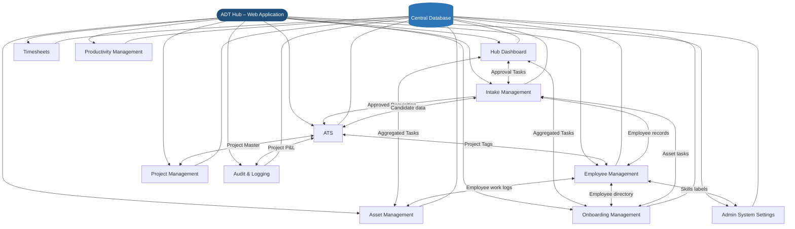
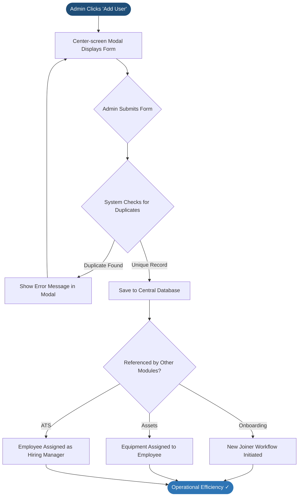
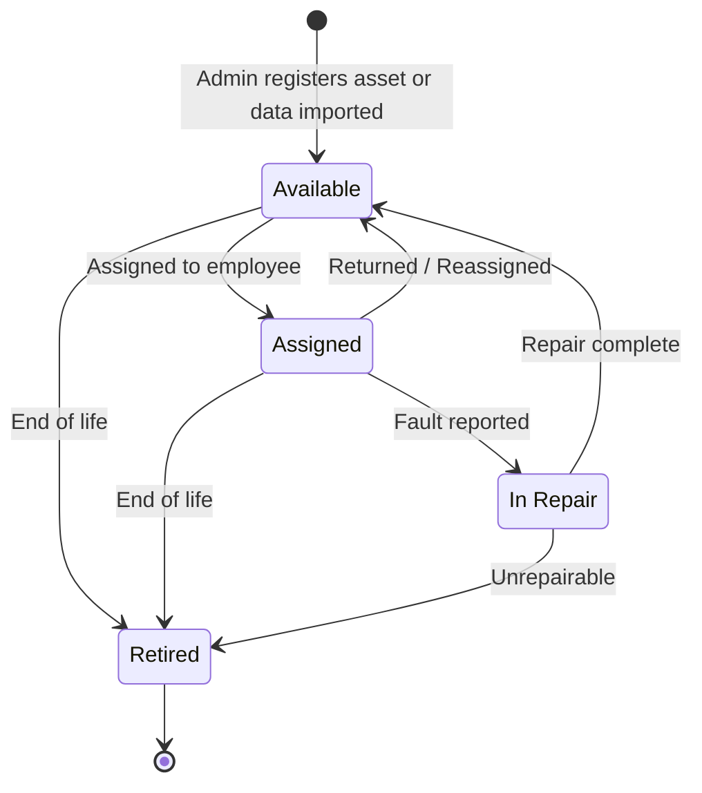
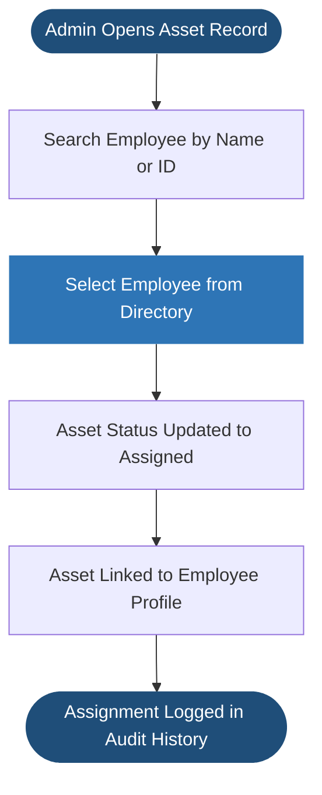
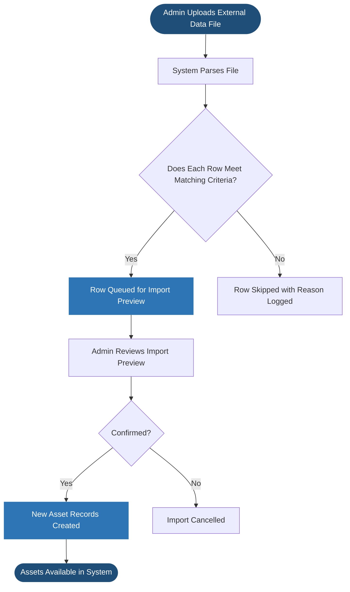
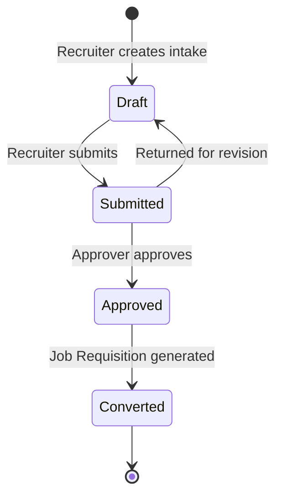
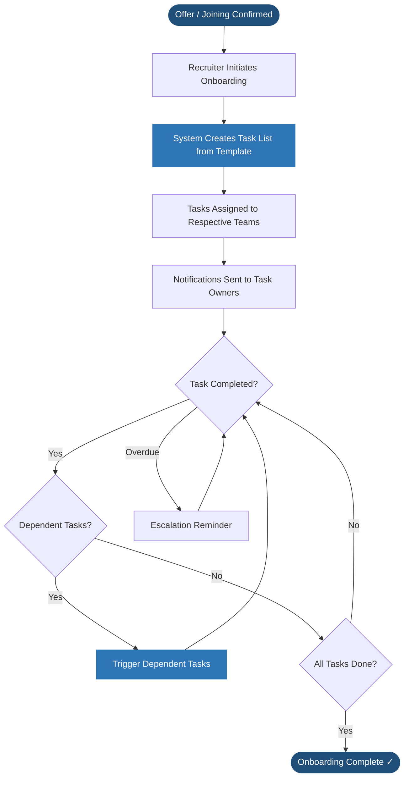
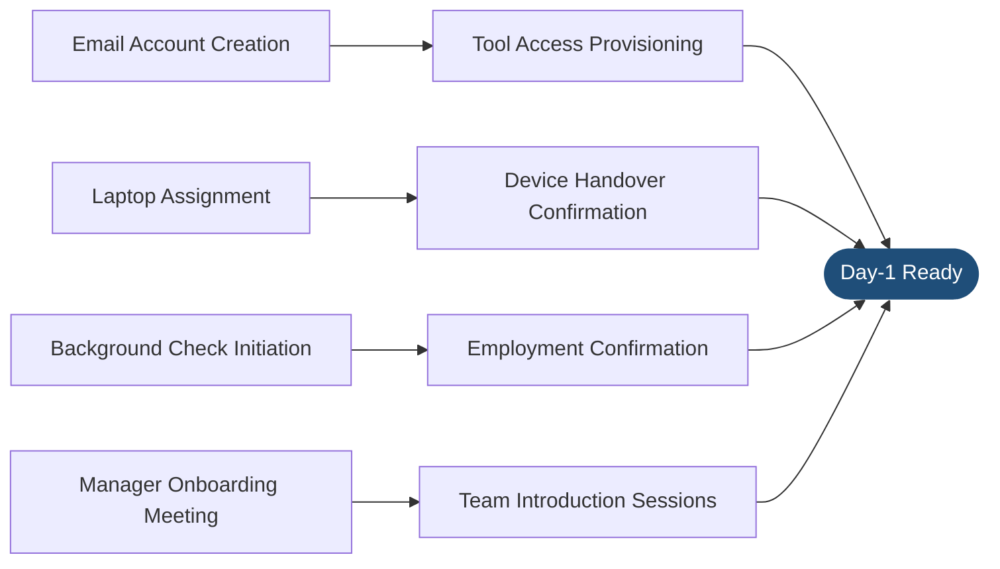
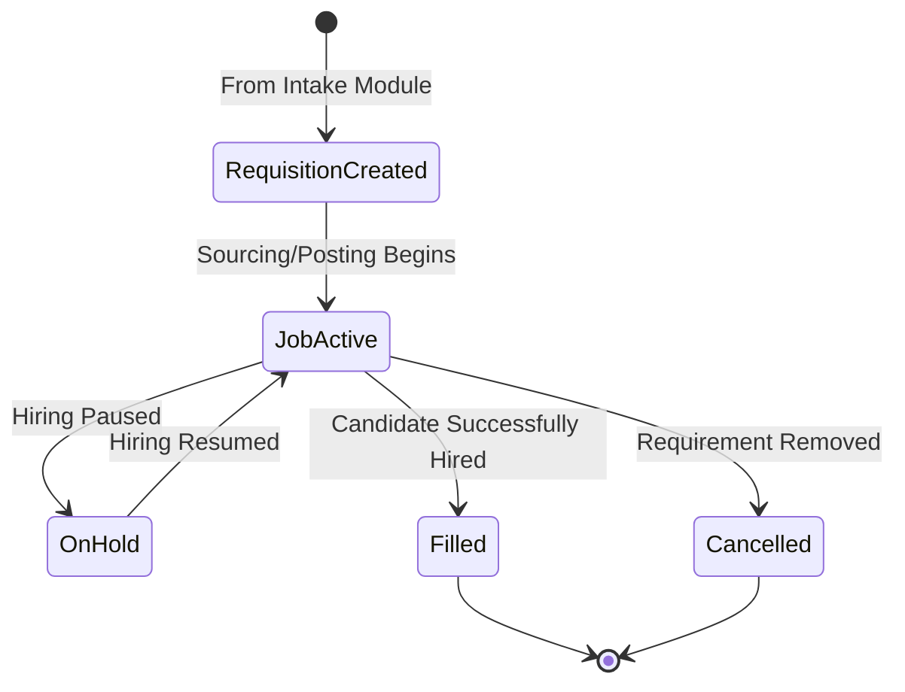

# ADT Hub – Product Specification Plan

**Version:** 1.1 – Onboarding Module Refined, Epic Priorities Updated  
**Date:** March 2026  
**Modules:** Hub Dashboard · Employee Management · Admin System Settings · Assets · Intake · Onboarding · Project Management *(Low Priority)* · Audit & Logging *(Low Priority)* · Timesheets *(Low Priority)* · Productivity Management *(Low Priority)* · ATS *(Low Priority)*

---

## Document Overview

This Specification Plan defines the functional scope, objectives, user flows, and requirements for the eleven modules of ADT Hub. It is intended to align product, engineering, and business stakeholders before detailed design and development begins. Epics 1–6 are **High Priority** and defined in detail. Epics 7–11 are **Low Priority** and defined at a high level for future development phases.

### Application Architecture

ADT Hub is a web application. Each module is a dedicated section of the application with its own pages, accessible via a shared navigation. All modules store and retrieve data from a central database, and modules are connected to each other — meaning data created in one module (such as an employee record) can be referenced and used in another (such as assigning that employee an asset or including them in an onboarding workflow).



Each module also supports connections to external services where relevant — such as email notifications, AI generation, and importing data from external sources — without requiring users to leave the application.

| Epic | Module | Purpose | Primary Users | Priority |
|---|---|---|---|---|
| **1** | Hub Dashboard | Personalized intelligence center aggregating tasks, metrics, and alerts from all modules into a single landing page | All Users | **High** |
| **2** | Employee Management | Authoritative system of record for all personnel data, unified directory, smart project tagging, and dedicated Offboarding Hub | HR, Admins | **High** |
| **3** | Admin System Settings | Master control center for global metadata, Role-Based Access Control (RBAC), notifications, and system security | Admins | **High** |
| **4** | Asset Management | Register, assign, and track company assets throughout their full lifecycle with warranty monitoring | Admins, IT, HR | **High** |
| **5** | Intake Management | Capture and approve hiring requirements; manage requisitions, candidates, and approval workflows | Recruiters, Hiring Managers, Admins | **High** |
| **6** | Onboarding Management | Orchestrate cross-team onboarding journeys for new joiners using a Visual Template engine with node-based automation | HR, IT, Admin, Hiring Managers | **High** |
| **7** | Project Management | Operational hub for project definitions, tagging, team assignments, and status tracking | Admins, Project Managers | *Low Priority* |
| **8** | Audit & Logging | System-wide tracking of user actions and record changes for compliance and governance | Admins | *Low Priority* |
| **9** | Timesheets | Track employee work hours against projects with billable/non-billable logic | Employees, Managers, Finance | *Low Priority* |
| **10** | Productivity Management | Centralized control of project P&L, employee cost structures, and margins | Admins | *Low Priority* |
| **11** | ATS | Manage the end-to-end recruitment process from job posting to offer | Recruiters, Hiring Managers | *Low Priority* |

---

## Shared Platform Components

These components are persistent and accessible across every module in ADT Hub, ensuring a unified user experience and consistent administrative oversight.

### Global Notification Inbox
- **Purpose**: A system-wide activity log that keeps users informed of relevant updates, mentions, and automated alerts regardless of which module they are currently browsing.
- **UI Placement**: Accessible via a persistent bell icon in the top navigation bar.
- **Behavior**:
    - **Real-Time Alerts**: New notifications trigger a visual badge (counter).
    - **Role-Based Routing**: Notifications are filtered by user role and department (as defined in Epic 3).
    - **Actionable Links**: Most notifications provide direct links to the relevant record (e.g., clicking a "New Onboarding" alert takes the user directly to that joiner's task list).
    - **Cross-Module Persistence**: The inbox state and read/unread status are synchronized across all application pages.

### My Tasks (Global Task Center)
- **Purpose**: A centralized, cross-module task feed that aggregates every open action item assigned to the current user — regardless of which module generated it (e.g., Onboarding tasks, Asset check-ins, Intake approvals).
- **UI Placement**: Accessible as a persistent item in the top navigation bar, alongside the Notification Inbox.
- **Behavior**:
    - **Unified Feed**: All pending tasks assigned to the current user's role or directly to them are pulled into a single, prioritized list.
    - **Module Badges**: Each task is tagged with the module it originated from (e.g., "Onboarding", "Asset") for quick context.
    - **Real-Time Counters**: The navigation icon displays a live count of open, unread tasks.
    - **Actionable**: Clicking any task opens the relevant record or checklist directly.

---

## Epic 1 – Hub Dashboard

### Overview
The Hub Dashboard is the default landing page for every user in ADT Hub. It serves as a personalized intelligence center that aggregates critical data and actionable tasks from all modules into a single, high-visibility interface.

### Key Features

| ID | Feature | Priority | Description |
|---|---|---|---|
| **1.1** | **Module Navigation Hub** | High | **Visual Directory**: A responsive grid display of all main modules (Employees, Assets, Intake, etc.) as large, interactive cards providing quick access. |
| **1.2** | **My Tasks Center** | High | **Unified Task Feed**: Aggregates actionable items from across the platform (e.g., Warranty alerts from 4.6, Offboarding tasks from 2.10, Approval requests from 5.3). |

### Logic Contracts
- **Landing Default**: Upon login, the system automatically redirects users to the Hub Dashboard.
- **Module Navigation Hub (Feature 1.1)**:
    - **Dynamic Cards**: Each card displays the module name and a high-level status indicator (e.g., "3 Pending Approvals" in Intake).
- **Task Aggregation (Feature 1.2)**:
    - **Synchronized Feed**: The "My Tasks" center pulls live data from individual module task pools. Completing a task in the Dashboard marks it as complete in the source module and vice versa.
    - **Sorting & Urgency**: Tasks are sorted by **Deadline** (fetched from 3.4) by default.
- **Role-Based Personalization**:
    - **Configurable Dashboard**: The specific modules visible in the **Module Navigation Hub (1.1)** and the task categories shown in the **My Tasks Center (1.2)** are assigned at the **Role level** within Epic 3.
    - **Aggregation Logic (Multi-Role)**: For users assigned multiple roles, the dashboard displays the **union (additive)** of all components assigned to any of their roles. If Role A grants access to "Employees" and Role B grants access to "Assets," the user sees both on their Module Hub. This ensures no relevant data is hidden due to role conflicts.
    - **Manager Access**: Roles flagged as "Manager Type" in Epic 3 automatically gain access to relevant supervisor widgets and task escalations.

---

## Epic 2 – Employee Management

### Overview
The Employee Management module is the central system of record for all staff, divided into two primary business units:
1. **Employees Directory**: The management hub for active personnel records.
2. **Newly Offboarded**: A specialized workflow module for managing the decommissioning of archived staff via task-based checklists.

### Business Objectives
- Maintain a single, authoritative source of truth for all employee personnel data
- Ensure data consistency across the platform by centralizing record management
- Streamline administrative workflows by providing a searchable directory for other modules

### Employee Data Groups

| Group | Fields |
|---|---|
| **Employee Data** | Employee ID (Auto-assigned), Name, Work Email, Job Title, Dept, Manager, Status, Hire Type, Work Mode |
| **Asset Info** | **Read-only**: Asset Count (Table), Asset List (Profile); Navigation links to Asset Module (Epic 4) |
| **Project Tracking** | Active Projects (Tags); **Project History**: Historical assignments with roles/dates (Editable in Profile) |
| **Attachments** | Employment contracts, IDs, Certifications, and other documents (Upload/View/Download) |

### Project Tagging Architecture (Smart Assignment)

When an employee is tagged to a project in the creation modal or profile, the system leverages **Epic 7 (Project Management)**:
- **Project Lookup**: Searchable master list from Epic 7.
- **Inline Creation Flow**:
    - **Inheritance**: Selecting "Create New" inherits the text currently typed in the search field as the project name.
    - **Input Clearing**: Upon selection, the search/tag field (the "project field") is cleared immediately to allow for subsequent searches, and the name is transferred to the newly expanded project details section.
    - **Atomic Save**: New project entries are only persisted to the database (Epic 7) upon the final "Save" of the employee record. If the modal or edits are canceled, no project record is created.
- **Metadata per Tag**: For each project assigned, a distinct section expands to capture:
    - **Project Role**: Specific role on this project (source: Epic 7 / custom).
- **Management**: Users can delete tags or **collapse** expanded sections (via a toggle/button next to each entry) directly from the UI.

### Scope
**In Scope**
- Master record creation and management (HR/Admin only)
- Centralized employee directory available to other modules
- Tracking of comprehensive employment details (as defined in Data Groups)
- **Project Tracking**: Multi-tag assignment of employees to active and historical projects

**Out of Scope**
- Employee self-service portals
- Performance management or payroll
- AI-driven skills intelligence (Managed via Intake/Recruitment modules)
- Talent/gap analysis (Advanced AI beyond basic search)

### User Flow



### Key Features (Priority-Based)

| ID | Feature | Priority | Data Captured | Data Displayed |
|---|---|---|---|---|
| **2.1** | **Employee Directory Table View** | High | Click/Navigation | **Admin Mode Toggle**: Top-level button to enable management controls; Table format (Sorted by Employee ID by default); **Actions**: View (2.4 read-only), Edit (2.4 edit mode), Audit (10.1 - Red in Admin Mode), **Archive** (Red, visible in Admin Mode only) |
| **2.2** | **Modal-Based User Creation** | High | **Mandatory**: Name, Dept, Location, Status (**New Onboard**, **Active**), Hire Type, Work Mode; **Optional**: Job Title, Manager, Attachments, Project Tags | "Add User" button; Center-screen modal; **Predictive Email Generation**: Auto-formats `Name` to Entra standard; **Read-only ID preview**; **Validation**: Real-time completion status indicators per section |
| **2.3** | **Duplicate Detection Logic** | High | Work Email, Employee ID | **Real-time Validation**: Inline error indicators if unique fields are taken; **Pre-Save blocking**: Prevents submission if duplicates persist; Matches are case-insensitive and whitespace-trimmed |
| **2.4** | **Unified Employee Profile** | High | Ongoing updates to all [Employee Data Groups](#employee-data-groups); **Attachment Management** | **Management Hub**: Accessed via 2.1; View/Edit modes; **Project History Management**; **Document Center**; **Onboarding History**: View-only summary of the completed onboarding checklist and initiation dates from Epic 6 |
| **2.5** | **Advanced Search & Filtering** | High | Multi-field search query, Sort parameters, Status (**New Onboard**, **Active**, **Archiving**, **Archived**) | **Unified Search Bar**: Fuzzy search across all record fields; **Filter Options Button**: Expands to show multi-group filter chips; **Header-based Filtering**: Column titles allow direct search injection; **Advanced Sorting**: ID (Num), Name (Alpha), etc.; **Status Isolation**: **New Onboard** and **Active** records shown by default; Archived/Archiving records excluded unless toggled via "Show Archived" filters |
| **2.6** | **Admin Mode & Bulk Management** | High | Multi-selection set, File Upload (Import) | **Admin Mode UI**: Gradually shifting toggle reveals **Actions** (Dropdown) and **Export** (Stand-alone button); **Checklist Selection**: Left-side column; **Actions Menu**: Assign to Project, Archive, **Bulk Import** (Always enabled); **Export Button**: Exports selected or all (PDF/CSV); **Post-Import Filter**: Auto-filters view to show only newly imported records; **Safety Guards**: All actions require a confirmation popup before processing |
| **2.7** | **System-Wide Referencing** | Low | N/A (Data lookup via DB keys) | Selection dropdowns in other modules (Assets, ATS, etc.) using central DB keys |
| **2.8** | **Admin-Only Row Controls** | Low | UI Toggle State | Row-level buttons (Archive, Audit) highlighted in **Red**; Only visible when Admin Mode is active. *Audit action depends on Epic 8 (Low Priority).* |
| **2.9** | **Archived User Lifecycle** | High | Decommissioning checks, Project migration | **Workflow Integration**: Initial archiving sets status to **Archiving** and moves users to the "Newly Offboarded" sub-module; Final completion sets status to **Archived** |
| **2.10** | **Newly Offboarded (Offboarding Hub)** | High | Task status, Sign-off logs, Assignees, Deadlines | **Sub-Module View**: List of users with **Archiving** status; **Checklist Management**; **Manager Overview**: Role-specific dashboard for tracking all tasks and facilitating manual reassignment |


### Logic Contracts (Data Architecture)
- **Central Storage**: All employee records are stored in a centralized, secure relational database to ensure data integrity.
- **Duplicate Prevention Hierarchy**: 
    1. **Real-time Check**: As the user tabs out (blur) of the 'Work Email' or 'Employee ID' fields, the system performs an asynchronous lookup.
    2. **Inline Feedback**: If a match is found, the field is highlighted in red with an error message: "This [Field] is already in use."
    3. **Atomic Pre-submission Check**: A final check is performed on the server-side during the 'Save' transaction to prevent race conditions.
    4. **Matching Rules**: All unique field checks are case-insensitive and follow strict whitespace trimming.
- **Work Email Generation (Feature 2.2)**:
    - **Entra Alignment**: To ensure parity with company-existing AD/Entra accounts, the system automatically generates a proposed **Work Email** upon Name entry.
    - **Formatting Logic**: 
        1. Trim leading and trailing whitespace from the full name.
        2. Replaces internal spaces with a single period (`.`).
        3. Appends `@AtDawnTech.com`. 
    - **Example**: " Ryan Tjan " transforms to `Ryan.Tjan@AtDawnTech.com`.
    - **Manual Override**: While auto-generated for speed, the field remains editable to handle unique cases or middle initials if they differ from the standard.
- **Search & Filter Architecture**:
    - **Unified Search**: A single input searches all record fields (ID, Name, Role, etc.) for partial matches.
    - **Filter Logic**: A dedicated "Filter" button expands to reveal selection chips for Dept, Location, and Project.
    - **Contextual Search**: Clicking a column header in the table (2.1) automatically populates the search/filter criteria with that specific field's value.
    - **Sorting**: Toggle buttons next to the search bar allow for numeric (ID) and alphabetical (Name/Dept) sorting in ascending/descending order.
    - **Status Isolation**: Employees marked as **Archiving** or **Archived** are hidden from all default views, searches, and filters. **New Onboard** and **Active** statuses are considered "Live" and visible across all primary dashboards.
    - **Filtered Discovery**: A specialized "Show Non-Active" filter allows users to toggle between **Archiving** (Pending checks) and **Archived** (Closed/Decommissioned) records in the directory results.
    - **Deep Table Persistence**: The system caches the search query, active filter list, sort state, and **scroll position**. Navigating back from a profile (2.4) restores the table to its exact previous state.
- **System-Wide Referencing (Feature 2.7)**:
    - **Authoritative Source**: Epic 2 is the sole owner of employee identity. Modules (Assets, ATS, etc.) must reference the **Employee ID** (Primary Key) and never store duplicate PII (Name/Email) locally.
    - **Real-Time Lookup**: Other modules pull display names and contact info dynamically via the API to ensure they always reflect the latest updates from the Directory.
    - **Status Enforcement**: Modules must respect the employee status. Users with **Archiving** or **Archived** status are automatically excluded from "New Assignment" dropdowns (e.g., cannot assign a new Asset or a new Job Stakeholder role to an offboarded user).
    - **Global Traceability**: Clicking an Employee Name in any other module (e.g., Asset Owner in Epic 4) deep-links the user back to the **Unified Employee Profile (2.4)** for full context.
- **Immutable Records & Archiving**: Employee records cannot be permanently deleted from the system. Instead, they are moved to an 'Archive' state. Permanent removal is only possible via a specialized Admin Settings panel.
- **Auto-Incrementing IDs**: The system generates unique, incrementing Employee IDs for every new record created, ensuring no gaps or duplicates in the identification sequence. In the creation modal, this ID is displayed as a **read-only preview** and cannot be modified by the user.
- **Audit Integration**: The "View Audit" action in the directory table links to the Audit Module (Epic 8), automatically applying a filter for the selected user's history (Visible to Admins only).
- **Metadata Source**: Dropdown selections (Dept, Location, Hire Type, etc.) are managed via the **System Configuration (Epic 3)** to ensure global consistency.
- **Project Atomic Save**: Inline project creation within the employee modal is treated as a single transaction; projects are not added to the master table unless the employee record is successfully saved.
- **Asset Integration Logic**: 
    - **Read-Only**: Asset data (Count/List) is strictly read-only within Epic 2. No asset assignment or editing can occur in the Employee Creation or Profile screens.
    - **Epic 4 Authority**: All asset movements (assign/remove) must be performed within the **Asset Management (Epic 4)** module.
    - **Deep-Linking**: Clicking a specific asset in the profile (2.4) redirects the user to Epic 4 and automatically initiates a search for that asset's unique ID for immediate inspection.
- **Admin Mode Operations**:
    - **Configurable Access**: The visibility of the "Admin Mode" toggle and specific buttons (Actions/Export) is controlled by **Role Permissions** defined in Epic 3. This allows HR or other custom roles to be granted administrative editing/bulk powers.
    - **Toggle UI**: Toggling "Admin Mode" initiates a gradual visual shift revealing the **Actions** dropdown and a separate **Export** button. Toggling OFF hides these and row-level admin controls.
    - **Selection Logic**: The selection column is only visible in Admin Mode. Toggling OFF retains current selection (cached).
    - **Action States**: "Actions" menu (except Bulk Import) and "Export" button are greyed out until at least one user is selected.
    - **Row-Level Admin**: When Admin Mode is active, an **Archive** button (Red) appears in the row-level action menu alongside Audit (Red). These are hidden when toggled OFF.
    - **Smart Export**: Stand-alone button next to Actions; exports selected users or all (if 0 or all selected) to PDF/CSV.
    - **Action Confirmations**: Any administrative action (Single/Bulk Archive, Project Assignment, **Password Reset**) triggers a **confirmation popup** ("Are you sure you want to [Action] [N] users?") to prevent accidental errors.
    - **Bulk Import Behavior**: Unified under the Actions menu (always enabled). Upon successful import, the system **automatically filters the directory view** to display only the newly imported records for immediate administrative verification.
    - **Bulk Import Mapping**: Includes a smart-matching step to link CSV/Excel headers to internal fields.
    - **Permanent Deletion**: Controlled via a specific override within the Admin Actions set, requiring re-authentication and audit logging.
- **Draft Persistence**: If a user accidentally closes the creation modal (e.g., clicking the background overlay), all current input data is temporarily cached. Reopening the modal restores the previous session state.
- **Archived User Workflow (Lifecycle)**:
    - **Discovery**: Archived users are hidden by default. Access is managed via a "Show Archived" filter within the Advanced Filtering (2.5) system.
    - **Email Decommissioning**: The archiving process includes a mandatory checklist for administrators to verify "Work Email Decommissioned."
    - **Project Cleanup**: Upon archiving, the system automatically removes the employee from all **Active Project Tags** and creates corresponding entries in their **Project History** section (storing last role and exit date).
    - **Historical Integrity**: Archived records remain searchable (when filtered) to maintain audit trails for past project assignments and asset assignment history.
- **Project History Management**:
    - **Editable History**: Administrators can manually add, edit, or remove entries in the "Project History" section within the Employee Profile (2.4) to correct past assignment records.
    - **Admin Mode Account Actions**: When in Admin Mode, the Profile "Action Menu" reveals **"Reset Password"**, **"Detach 2FA Linkage"**, and **"Lock Account"** tools.
- **2FA Status Indicator (Feature 2.4)**:
    - **Visibility**: Every employee profile shows a "Security Status" badge (e.g., **2FA: Enabled** in Green or **2FA: Disabled** in Grey).
    - **Read-Only**: This is a system-generated indicator and cannot be toggled directly by the user on the profile screen (must be reset via Action Menu).
- **Document Management (Attachments)**:
    - **Storage**: Files are stored in a secure cloud bucket (S3/Azure Blob) with links preserved in the relational database.
    - **Actions**: Users with "Edit" permissions can upload new files, rename labels, or remove attachments. All users with "View" permissions can download or preview compatible formats (PDF, JPG).
    - **Audit**: Every document upload, download, or removal is logged in the user's Audit History (Epic 8).
- **Navigation Guard**: System triggers a standard browser confirmation dialog if the user attempts to reload or navigate away from the page while the creation modal has unsaved changes.
- **Role-Based Access Control (RBAC)**:
    - **Epic 3 Authority**: The "who" (which roles) can access Admin Mode or edit records is managed exclusively in the **System Configuration (Epic 3)** module.
    - **PII Masking**: Sensitive data visibility is controlled via the role-based toggles defined in Epic 3.
- **Offboarding & Task Pool Operations (Feature 2.10)**:
    - **Gradual Archival**: When an admin initiates an "Archive" action, the user record status shifts from **Active** to **Archiving**. They are moved to the **Newly Offboarded** sub-module and remain there until all checks are resolved.
    - **Mandatory Checks**:
        1. **Work Email Decommissioning** (Assigned to **IT** role).
        2. **Project History Migration** (Automated; verified by Manager).
        3. **Asset Retrieval** (Assigned to **HR/Asset Manager**; linked to Epic 4).
        4. **System Account Removal** (GitHub/Microsoft) (Assigned to **IT** role).
    - **The Task Pool**:
        - Tasks are not assigned to individuals initially but are instead pooled by **Role** (e.g., all IT users see pending email checks).
        - **Self-Assignment**: Users can "Pick up" a task from the pool, becoming the primary assignee.
        - **Sign-off**: Marking a check as resolved logs the specific user's ID and timestamp to the employee record and the **Audit Module (Epic 8)**.
    - **Deadline & Escalation Logic**:
        - **Task Deadlines**: Every offboarding check has a system-defined deadline (e.g., 72 hours from Archive initiation).
        - **Proactive Notifications**: When a task is within **24 hours of its deadline**, the system triggers a "Deadline Warning" notification to the **Assignee** and their **Manager Role**.
        - **Manager Role Oversight**:
        - **Role-Specific Dashboard**: Managers (e.g., IT Manager, HR Manager) have a specialized view within the sub-module to see **all pending and active tasks** assigned to their specific role group, regardless of the individual assignee.
        - **Manual Reassignment**: Managers can override any current assignment, reassigning a task from one role-employee to another, or "Pick up" the task themselves directly from their staff's queue.
    - **Finalization**: Only when all 4 checks are green can the user status be shifted to **Archived**. At this point, they are removed from the Newly Offboarded view and appear in the general Directory results only when the "Archived" filter is explicitly enabled.
- **Admin Mode functional logic**:
    - **Permission Check**: The "Admin Mode" toggle only appears if the user's role has the `can_access_employee_admin_mode` permission enabled in Epic 3.
    - **Action Logic**: All bulk and row-level admin actions (2.6, 2.8) are strictly gated by these central permissions.

### Roles & Permissions

| Role | Access |
|---|---|
| Admin | Full access to create, edit, and view all employee data |
| HR | Create and manage employee records |
| Employee / Manager | View-only access to the general directory (as allowed by system settings) |

### Acceptance Criteria
- **[2.1]** Authorized users can view a responsive table of employees with ID, Name, Role, Dept, Location, Manager, and Work Email, sorted by ID by default.
- **[2.1]** Admins can click "View Audit" to navigate to the Audit module with pre-filtered user history.
- **[2.2]** HR and Admins can trigger an "Add User" center-screen modal from the Table View page.
- **[2.2]** Clicking "Add New User" within the modal accurately persists all data points to the database.
- **[2.3]** System prevents record creation and displays a clear error if a duplicate Work Email or Employee ID is detected.
- **[2.4]** Once created/viewed, employee profiles accurately display all grouped information and current asset status.
- **[2.5]** Users can perform natural language searches and apply multi-dimensional filters (Dept, Role, etc.) to the directory.
- **[2.6]** Authorized users can access a centralized directory summary for personnel verification.
- **[2.7]** Employee records are selectable as primary data points (e.g., as Asset Assignees or Hiring Managers) in all downstream modules using secure database referencing.
- **[2.8]** Data integrity is maintained through strict RBAC, ensuring only authorized personnel can add or modify master records.

### Success Metrics
- 100% of staff accurately represented in the system of record
- Zero data silos between employee records and asset assignments
- Reduction in manual data entry when initiating onboarding workflows

---

## Epic 3 – Admin System Settings

### Overview
The Admin System Settings module is a master control center for ADT Hub. It is organized into specialized sub-modules to manage global metadata, security, and system-wide automation. This ensures that every module in the Hub operates from a single, consistent source of configuration.

### Sub-Modules & Features

| ID | Sub-Module | Feature | Priority | Data / Controls |
|---|---|---|---|---|
| **3.1** | **Dropdown Settings** | **Area-Specific Sub-Sub-Modules** | High | **Hierarchical Management**: Nested container for area-specific lists. <br>• **Global**: **Location** (Shared across Employees & Assets). <br>• **Employees**: Dept, Role Levels, Hire Types. <br>• **Intake**: Requisition Statuses, Reason for Hire, Hiring Priorities. <br>• **Onboarding**: Task Categories, Provisioning Stages. <br>• **Assets**: **Asset Item Types (Categories)**, **Asset Statuses**, Manufacturer, Condition. <br>• **Audit & Logging**: Event Severity, Log Categories. |
| **3.2** | **Skill Management** | **Skill Repository** | Medium | **Automated Library**: Dynamic repository of all skills. <br>• **Admin Tools**: Bulk select to delete; usage tracking (Intake counts). <br>• **Performance**: Paginated grid; fuzzy search; sort by **Date Added**. <br>• **Auto-Host**: Staged skills from Intake persist on save. |
| **3.3** | **Role & Permission Management** | **Additive Role System** | High | **Role Repository**: Centralized creation and management. <br>• **Permission Mapping**: Define action and visibility rights. <br>• **Assignment Hierarchy**: Define which roles can assign other roles. <br>• **Validation**: Real-time completion status indicators per section. |
| **3.4** | **Notification Module** | **Communication Hub** | Medium | **System Master Switches**: Global and module-specific toggles for Email/In-App alerts. <br>• **Threshold Management**: Centralized control for task deadlines, escalation timing, and **Asset Warranty Alert Thresholds** (Default: 2 months). |
| **3.5** | **Audit Settings** | **Governance & Compliance** | Low | **Retention Rules**: Global log storage durations. <br>• **Log Integrity**: Read-only enforcement; Export for external audits. |
| **3.6** | **System Security** | **Advanced Protection** | High | **Approval Gates**: "Block & Approve" for high-risk actions. <br>• **Snapshots**: Immutable 7-day backups with Selective Restore. |

### Logic Contracts (System Administration)
- **Three-Tier Hierarchy**: The UI reflects a **Module (Settings) > Sub-Module (Dropdowns) > Sub-Sub-Module (Area)** navigation pattern.
- **Dropdown Authority (Feature 3.1)**: 
    - **Sole Source of Truth**: These sub-sub-modules are the **only** locations where dropdown values for their respective areas (Employees, Intake, etc.) can be added, edited, or removed.
    - **Consumer Enforcement**: Other modules (e.g., Epic 2 creation modal) are strictly prohibited from using hardcoded lists or locally-stored options; they must fetch data dynamically from these settings.
    - **Global Rename Propagation**: Renaming an entry in any sub-sub-module dropdown list updates all records referencing that ID across the entire database instantly.
- **Skill Management (Feature 3.2)**: 
    - **Atomic Persistence**: New skills created on-the-fly in the Intake module (Epic 5) or Onboarding module (Epic 6) are **staged** locally during the session. They are only permanently added to the master database upon a successful "Save" of the parent record.
    - **Discard Logic**: If an intake or onboarding record is canceled or discarded before saving, any "New" skill tags created within that session are automatically purged.
    - **Smart Lookup & Mapping**: The system maintains a mapping layer for common abbreviations. If a user types "JS", the system proactively suggests "Javascript" as the primary tag while allowing the user to explicitly "Create New" if they have a distinct requirement.
    - **Admin Bulk Actions**: Admins can bulk-select tags to delete or merge. To prevent data loss, the system displays a **Usage Count** (how many Intakes/Profiles use this tag) upon selection.
    - **Search & Filtering**: The repository includes a fuzzy-search bar for finding specific tags and clickable headers to sort the library by 'Date Created' (Ascending/Descending).
    - **Performance Optimization (Pagination)**: To ensure high performance with thousands of tags, the grid implements server-side pagination with a configurable limit (e.g., 50 per page).
    - **Proficiency Removal**: Proficiency levels are explicitly out of scope for the global skill repository to maintain maximum simplicity.
    - **Role-Based Access Control (Feature 3.3)**:
    - **Sole Source of Authority**: All roles—including Employee types, Manager levels, and Admin tiers—must be created and configured **exclusively** within this sub-module.
    - **Role-as-Entity System**: Roles are treated as standardized system objects with unique IDs and specific permission payloads.
    - **Manager Role Attribution**: Admins can flag a role as a **"Manager Type."**
        - **Departmental Linking**: Manager roles can be linked to a specific **Department** (e.g., "IT Manager" is linked to the "Information Technology" department).
        - **Authoritative Scoping**: This link is used by other modules to identify the "Manager of Record" for departmental approvals or escalations.
    - **Multi-Role Assignment**: A single user can be assigned **multiple roles** simultaneously.
    - **Additive Permission Logic (OR Gate)**: Permissions are cumulative. If any assigned role grants a permission, the user has it.
    - **Assignment Hierarchy & Permissions**:
        - **Granting Rights**: The RBAC grid includes a section for "Role Assignment Permissions." This defines which specific roles (e.g., 'IT Support', 'Staff') a role (e.g., 'HR Manager') is allowed to assign to others.
    - **Action Permission Handling (The "Verb" Grid)**:
        - **Module Scoping (Examples)**:
            - **Employees (Personnel)**: `can_create_employee`, `can_archive_employee`, `can_edit_project_history`, `can_manage_attachments`.
            - **Asset Management**: `can_assign_asset`, `can_retire_asset`, `can_edit_asset_metadata`, `can_view_asset_valuation`.
        - **Granular Toggle**: Each role is assigned specific "Verbs" via a grid of checkboxes.
        - **Module-Specific Privileged Modes**:
            - **Employees (Admin Mode)**: The `can_access_employee_admin_mode` toggle.
            - **Assets (Edit Mode)**: The `can_access_asset_edit_mode` toggle.
            - **Functional Gating**: If the specific module toggle is not checked for a role, the corresponding "Admin Mode" or "Edit Mode" switch remains hidden within that module.
        - **Backend Enforcement**: Each API request checks the user's active role(s) for the specific action key. If the key is missing from all assigned roles, the request is rejected before data processing.
    - **Visibility Toggle Handling (The "Noun" Grid)**:
        - **PII Shielding**: Visibility is handled via "Data Scopes." Roles can be toggled to "Reveal PII," "Reveal Financials," or "Reveal Audit Trails." Without these, fields appear as masked (asterisks) or the entire column/section is hidden.
    - **Dashboard Component Assignment**:
        - **Configuration Pane**: A dedicated section within the Role Editor allowing admins to select which **Epic 1** components are active for that role.
        - **Module Visibility**: Checkbox list of all system modules (Employees, Assets, etc.) to define what appears in the user's **Module Navigation Hub (1.1)**.
        - **Task Feed Filtering**: Selection of task categories (e.g., "IT Tasks," "HR Approvals") that populate the user's **My Tasks Center (1.2)**.
        - **Persistence**: These assignments are stored as a configuration string in the role's permission payload, fetched by the dashboard front-end on load.
- **Notification Central (Feature 3.4)**:
    - **Hierarchy of Control**:
        - **Global Kill-Switch**: A master toggle to disable all outgoing communications (Email/In-App).
        - **Module & Role Toggles**: Admins assign triggers to **Roles (3.3)**.
        - **Notification Channels**: For each trigger, the system allows selecting **"My Tasks" (In-App)**, **"Work Email"**, or **"Both"**.
        - **Email Enforcement**: All external alerts are strictly routed to the user's **Work Email Address** as stored in their Employee Profile.
    - **Notification Scoping (Anti-Fatigue)**:
        - **Role-Wide Alerts**: Broad alerts (e.g., "New Intake Created") are sent to all users with the assigned Role.
        - **Assignment-Specific Alerts**: For task-based modules (e.g., Offboarding tasks), notifications are **only** sent to the specific user assigned to that task, even if multiple users hold the same functional role.
    - **Timing & Thresholds**:
        - **Dynamic Deadlines**: Set standard task durations (e.g., 72hr Offboarding).
        - **Departmental Escalation Triggers**: Escalation alerts are routed using the **Departmental Link** from Epic 3.3.
            - **Scoped Routing**: If an IT-specific task misses a deadline, the escalation notification is sent **only** to the role(s) defined as the "Manager" of the "IT" department. This prevents managers in unrelated departments (e.g., HR) from receiving irrelevant alerts.
    - **Role-Based Routing**: Notifications are mapped to **Roles**, ensuring "My Tasks" feeds and email alerts synchronize automatically with role changes.
- **Audit & Governance (Feature 3.5)**:
    - **Retention Policy**: Admins set the "Shelf Life" for system logs (e.g., 90 days, 1 year, or Infinite). 
    - **Retention Change Grace Period**: 
        - **Logic**: Any change to the retention policy that would result in log deletion triggers a mandatory **7-day Grace Period**.
        - **Data Preservation**: Logs that exceed the *new* limit but were valid under the *old* limit (or are within 7 days of the new limit) are protected from the automated purge for exactly **168 hours (7 days)**.
        - **Recovery Window**: This provides a "Safety Buffer" to revert the retention change if it was made in error or by a bad actor before any data is permanently erased.
    - **Immutable Logs**: Once an audit event is recorded, it cannot be edited or deleted by any user account. Entries are only removed by the automated retention purge (after the grace period).
    - **Export for Compliance**: Admins can generate signed PDF or CSV exports of audit trails specifically for external compliance reviews.
- **System Security (Feature 3.6)**:
    - **Daily Snapshot Rotation**:
        - **Automatic Cycle**: The system generates a full database snapshot once every 24 hours.
        - **3-Day Retention**: Standard snapshots are automatically deleted after **72 hours (3 days)** to optimize storage.
    - **Security Triggers (Gated Actions)**:
        - **Category 1: Nuclear Reset Triggers (Lockdown + Gate)**:
            - **Triggers**: Attempted deletion of **all data** for primary modules (Employees, Intake, Onboarding, Assets, Projects, Audit Logs).
            - **Lockdown Behavior**: Upon trigger, the **most recent daily snapshot** is immediately "Promoted" to a **7-Day Lockdown** status.
            - **Immutable Lockdown**: Once promoted, the snapshot cannot be deleted or modified for 168 hours (7 days), even by System Admins.
        - **Category 2: Critical Management Triggers (Gate Only)**:
            - **Triggers**: 
                - **Bulk Archiving**: >10 employees in a single transaction.
                - **Velocity Purge**: 10 separate employee archiving actions within a 1-hour rolling window.
                - **Structural Changes**: Deleting a System Role or Modifying Audit Retention.
                - **Account Security**: Detaching User 2FA, Suspicious individual password resets.
            - **Behavior**: System **blocks the action** and alerts System Admins for manual approval. Does not trigger a 7-day snapshot lockdown.
    - **Sealed Storage**: All snapshots (Daily and Locked) are stored in a restricted volume; they cannot be moved, copied, downloaded, or exported to prevent external exploitation.
    - **Surgical Restore Wizard**:
        - **Restore Source**: Uses the 7-Day Locked Snapshot to revert the system.
        - **Non-Destructive Merge**: The wizard allows Admins to "Roll Back" specific compromised records while **expressly preserving** all new data, projects, or employees created after the snapshot was taken.
    - **Admin Oversight**: All Category 1 & 2 actions trigger a **Priority 1 Alert**. Changes are only committed upon explicit Admin approval in the Security Dashboard.
    - **Account Infrastructure**:
        - **Password Storage**: All passwords must be salted and hashed using industry-standard algorithms (e.g., Argon2 or BCrypt). The live database never stores cleartext passwords.
        - **2FA Linkage**:
            - **Provider Agnostic**: The system supports linkage to TOTP (Authenticator Apps) or SMS/Email-based 2FA.
            - **Mandatory Gating**: Admins can enforce "Mandatory 2FA" for specific high-privilege roles (defined in 3.3).
            - **Reset Logic**: 2FA resets follow the same "Approval Gate" as high-risk actions to prevent account takeovers via social engineering.
- **Deduplication Logic**: System blocks duplicate entries in metadata and skill lists to prevent "Data Drift" (e.g., prevents having both "NYC" and "New York City" as locations).

---

---

## Epic 4 – Asset Management

### Overview

The Asset Management module is a dedicated section of the ADT Hub web application and acts as the system of record for all company-owned assets. Authorized users can register assets, assign them to employees using data from the Employee Management module, and track their full lifecycle. The module also supports importing asset data from external sources and attaching invoices for verification, with all records stored centrally and linked to employee profiles.

### Business Objectives

- Maintain a single, reliable source of truth for all company assets
- Ensure complete asset traceability and audit compliance
- Reduce asset loss and mismanagement
- Enable proactive warranty and replacement planning
- Improve onboarding efficiency through faster asset assignment

### Scope

**In Scope**
- Asset registration and master data management
- Asset assignment and reassignment via Employee Management integration
- Dedicated asset detail page per asset record
- Immutable asset records (non-deletable; status changes only)
- Search and filter across all asset records
- Automated warranty expiry notifications
- Bulk asset import from external data sources with configurable field-matching criteria
- Invoice attachment and asset-to-invoice verification

**Out of Scope**
- Asset procurement workflows and vendor payments
- Asset depreciation and accounting
- Asset disposal approval workflows

### Asset Lifecycle



### Warranty Alert Flow


### Key Features (Priority-Based)

| ID | Feature | Priority | Data Captured | Data Displayed |
|---|---|---|---|---|
| **4.1** | **Asset Directory Table View** | High | Click/Navigation | Table format (Sorted by Asset ID by default); Columns: **Asset ID**, **Manufacturer & Model**, **Location**, **Assigned To**, **Status**, **Warranty End Date**, and **Actions**; View Detail (4.3) |
| **4.2** | **Smart Asset Registration** | High | **Mandatory**: Belongs to ADT, Category, Manufacturer/Model, Local Dates, Location, Status; **Optional**: Serial Number, Vendor, Assigned To, Invoice | **Registration Hub**: Center-screen modal; **Auto-ID**: `[LOC]-[CAT]-[0001]`; **Integrity**: Real-time uniqueness check; **Validation**: Real-time completion status indicators per section |
| **4.3** | **Unified Asset Profile** | High | Updates to data groups | **Management Hub**: Detail view with full lifecycle history and deep-linking back to Epic 2 (Employee Profile) |
| **4.4** | **Advanced Search & Filtering** | High | Multi-field query, Category/Status chips | Fuzzy search across serials/assignees; Column-header search injection; Cached scroll/filter state |
| **4.5** | **Edit Mode & Bulk Management** | High | Multi-selection set | **Edit Mode UI**: Toggle reveals Actions (Dropdown) and Export; Checklist Selection; Bulk Status Updates; Export (PDF/CSV) |
| **4.6** | **Warranty Monitoring** | Medium | Alert settings | Automated notifications 2 months prior; Escalation paths; Dashboard summary |
| **4.7** | **Bulk Data Import** | Medium | External file, Header mapping | Pre-import verification; Conflict logging; **Post-Import Filter**: Auto-filters view to show only newly imported records |
| **4.8** | **Invoice Attachment** | Medium | Uploaded Invoice, Verification notes | Document storage; Verification status (Verified/Mismatch) |

### Employee Assignment Flow



### External Data Import Flow



**Import matching criteria are configurable by Admin** and define which fields must be present and valid for a record to be accepted into the system.

### Invoice Attachment & Verification Flow


### Asset Data Captured

| Field | Details |
|---|---|
| **Belongs to ADT** | **Mandatory** Boolean toggle (Yes/No) indicating if the asset is company-owned vs third-party |
| **Asset Category** | **Mandatory** Dropdown (managed in 3.1); Includes Laptop, Monitor, etc. |
| **Manufacturer & Model** | **Mandatory** Free text (Smart Autocomplete) |
| **Asset ID** | **Auto-Generated** unique identifier (e.g., IND-LAP-0001); See Feature 3.3 for logic |
| Serial Number / Asset Tag | Physical manufacturer ID (Optional) |
| **Procurement Date** | **Mandatory** Date for tracking |
| Vendor | Procurement source (Optional) |
| Warranty Start Date | Date for tracking (Optional) |
| **Warranty End Date** | **Mandatory** Date for tracking; triggers automated alerts (4.6) |
| Warranty Type | Standard / Extended (Optional) |
| **Current Status** | **Mandatory** Dropdown (managed in 3.1); Available / Assigned / In Repair / Retired |
| Assigned To | Linked from Employee Management directory (Optional) |
| **Location** | **Mandatory** Dropdown (Shared Global List in 3.1) |
| Invoice Attachments | Uploaded invoices with verification status (Optional) |
| Import Source | Populated if record was created via external data import |
| **Notes** | Free text for additional asset details (Optional) |

### Logic Contracts (Data Architecture)

- **Regional Authority**: Epic 4 is the master source for all equipment data.
- **Asset Directory Table View (Feature 4.1)**:
    - **Default View**: Read-only directory for all active assets.
    - **Header Injection**: Clicking a table header automatically injects that column's value into the Advanced Filter (4.4).
- **Advanced Search & Filtering (Feature 4.4)**:
    - **Fuzzy Search**: Single bar searching across Serial Number, Manufacturer, Model, and **Assigned To** Name.
    - **Dropdown Chips**: Category, Status (Available/Assigned/Retired), and Location filtering.
    - **Universal State Persistence**: Filters, search queries, and scroll positions are strictly preserved during:
        - Navigation to and from the **Unified Asset Profile** (4.3).
        - Activation and usage of **Edit Mode** (4.5).
        - Execution of **Bulk Management** operations (4.5) to avoid losing the targeted dataset.
- **Edit Mode & Bulk Management (Feature 4.5)**:
    - **Mode Toggle**: Gated by the `can_access_asset_edit_mode` permission (Epic 3). Toggling ON reveals the **Actions Dropdown** and **Export** button.
    - **Row Actions**: Reveals **Edit**, **Archive** (Red), and **Audit** (Red) buttons at the row level.
    - **Bulk Operations**: multi-select checklist appears; allows bulk "Change Status" or "Assign to Location."
    - **Post-Action Filter**: After a bulk update, the system automatically filters the table to show only the affected records for final verification.
- **Smart Asset Registration & Integrity (Feature 4.2)**:
    - **Uniform UI**: Matches the "Add User" modal pattern (Epic 2) for a consistent administrative experience.
    - **Asset ID Generation**: Upon selection of **Location** and **Asset Category**, the system calculates and displays a **read-only preview** of the Asset ID:
        - `[First 3 letters of Location]-[First 3 letters of Category]-[4-Digit Incremental ID]` (e.g., `IND-LAP-0001`).
    - **Real-Time Integrity**:
        - **Serial Number Check**: Any manually entered Serial Number is checked for uniqueness in real-time.
        - **ID Conflict Prevention**: Re-verifies ID availability upon final "Save" submission.
    - **Smart Autocomplete**: Predictive text for **Manufacturer**, **Model**, and **Vendor** fields.
    - **Draft Persistence**: Form data is cached if the modal is closed without saving.
    - **Invoice Input**: Dedicated file-upload zone for attaching invoices during creation (Feature 4.8).
- **Unified Asset Profile (Feature 4.3)**:
    - **Access Trigger**: This dedicated management view is accessed by selecting the **View** action (4.1) on any asset record.
    - **Comprehensive Data Display**: Lists every data point captured during registration (4.2):
        - **Asset Identity**: Auto-Generated **Asset ID**, **Manufacturer & Model**, and physical **Serial Number**.
        - **Financials**: **Procurement Date**, **Warranty Start & End Dates**, **Warranty Type**, **Vendor**, and **Invoice Attachments** (4.8).
        - **Governance**: **Belongs to ADT** (Toggle), **Asset Category**, **Location**, and **Notes**.
        - **Assignment & State**: **Current Status** and **Assigned To** (Deep-link to Epic 2).
    - **Lifecycle Ledger**: Displays a chronological feed of all status changes, assignments, and repairs (sourced from Epic 8).
    - **Financial Pane**: Provides a quick-view summary of warranty status (4.6) and invoice verification status (4.8).
- **Warranty Monitoring (Feature 4.6)**:
    - **Trigger Logic**: The system initiates automated notifications based on the **Warranty End Date** captured in 4.2.
    - **Configurability**: The lead time for these alerts (e.g., 60 days) is fetched dynamically from the **Admin System Settings (3.4)**.
    - **Escalation Sync**: Alerts are routed to the assigned Asset Manager and Escalation Contacts defined in Epic 3.3.
- **Metadata Sourcing**: Dropdown options (Category, Status, Location) fetched from **Admin System Settings (Epic 3)**.
- **Audit Integration**: Every registration event is logged with the **Created Asset ID**, administrative user, and timestamp.
- **Invoice-Asset Mapping (Feature 4.8)**:
    - **Deep Linkage**: Invoices are linked via a shared database key.
    - **Cross-Verification**: Verification status is exposed on the asset record.

### Acceptance Criteria
- **[4.1]** Users can view a complete directory of assets with primary data columns.
- **[4.2]** System generates a unique Asset ID (IND-LAP-0001) in real-time during registration and enforces serial number uniqueness.
- **[4.3]** Every asset has a dedicated detail page with full lifecycle and invoice history.
- **[4.4]** Users can search and filter across all data dimensions with state persistence.
- **[4.5]** Edit Mode provides gated access to bulk actions and row-level management.
- **[4.6]** Automated alerts trigger prior to warranty expiry based on configurable thresholds in System Settings (Epic 3).
- **[4.7]** Bulk import supports matching criteria and pre-import verification, and automatically filters the view to show newly imported records on success.
- **[3.8]** Invoices can be attached and verified against asset records.

### Success Metrics

- % of assets accurately tracked in the system
- Reduction in missing or unaccounted assets
- % of warranty expiries proactively addressed
- Reduction in onboarding delays due to asset unavailability

---

## Epic 5 – Intake Management

### Overview
The Intake Management module is a dedicated section of the ADT Hub web application and serves as the starting point of the hiring lifecycle. It allows recruiters to capture structured hiring information through an online form and automatically generates a Job Requisition and a draft Job Description upon approval. Data entered here is stored centrally and connects to the Employee Management module for skills data.

### Business Objectives
- Reduce time to create and approve job requisitions
- Improve quality and consistency of job descriptions
- Create a single source of truth for hiring requirements
- Enable scalable hiring processes as the organisation grows

### Scope
**In Scope**
- Intake form creation and management
- Structured data capture (budget, location, skills, role level, employment type, business context)
- Skill tagging with smart label creation and reuse
- Validation of mandatory fields
- Conversion of intake into Job Requisition
- AI-assisted JD generation based on intake data and existing JD formats
- Status tracking: Draft → Submitted → Approved → Converted

### Key Features (Priority-Based)

| ID | Feature | Priority | Data Captured | Data Displayed |
|---|---|---|---|---|
| **5.1** | **Intake Directory Table** | High | Click/Navigation | Table format; Columns: **Role Title**, **Hiring Manager**, **Hiring Type**, **Department**, **Location**, **Positions**, **Status**, **Creation Date**, and **Actions**; View Profile (5.3), **Export (PDF/CSV)** |
| **5.2** | **Intake Creation Modal** | High | Multi-section attributes (See 5.2 Schema Below) | **Creation Hub**: Center-screen modal; **Auto-ID**: INT-XXXX (System-gen on save); **Validation**: Real-time completion status indicators per section |
| **5.3** | **Unified Intake Profile** | High | Record updates | **Management Hub**: Detail view with full context and Audit History (5.10). |
| **5.4** | **Skill Tagging** | Medium | Skill name (search/create), Proficiency level | Skill labels, Global skill library indicators |
| **5.5** | **Advanced Search & Filters** | High | Multi-field query, Category/Status chips | Fuzzy search across managers/titles; Column-header search injection; Cached scroll/filter state |
| **5.6** | **Intake Edit Mode & Bulk Management** | High | Multi-selection set | **Edit Mode UI**: Toggle reveals Actions (Dropdown) and Export; Checklist Selection; Bulk Status Updates; Export (PDF/CSV) |
| **5.7** | **Approval Workflow** | High | Approver selection, Approval/Rejection comments | Status (Draft → Submitted → Approved), Approval history |
| **5.8** | **Role-Based Access** | High | User permissions configuration | User-specific view/edit permissions |
| **5.9** | **AI JD Generation** | Low | Tone/Style preferences (optional) | Draft Job Description content |
| **5.10** | **Audit Trail** | Low | N/A (System log) | Change log (Who/When/What), Prior versions |
| **5.11** | **Handoff to ATS** | High | Target Job Requisition settings | Link to generated Job Req, Handoff timestamp |

### Feature 5.2 – Detailed Field Schema & Logic (Creation Modal)

The Intake Creation Modal is a dynamic UI component governed by the following data types and validation rules:

| Section | Field | Type | Logic / UI Behavior |
|---|---|---|---|
| **Identity** | **Intake ID** | Auto-Generated | Unique identifier (e.g., INT-0001). **System-generated on save; hidden from form UI.** |
| **Stakeholders** | **Hiring Manager** | String (Name/Email) | External contact fields (Not linked to Epic 2). |
| | **Department** | Searchable Text | Fuzzy-search autocomplete; suggests existing departments from **Epic 3.1**. |
| | **Preferred Panelists** | Searchable Text | Search/Insert tags for internal stakeholders. |
| | **Recruiting Agencies** | Auto-complete | Dynamic search against the global vendor list (specifically for external agencies). |
| **Role Specs** | **Number of Openings** | Number Stepper | Up/Down arrows; Minimum value: 1. |
| | **Min/Max Budget** | Dual Number Input | **Validation**: Submission blocked if `Min > Max`. |
| | **Currency** | Dropdown (3.1) | Managed in global settings; adjacent to budget inputs. |
| | **Min Experience** | Number (Years) | Captures required years of experience as an integer. |
| | **Location** | Dropdown (3.1) | Primary work location (Shared Global List). |
| | **Work Model** | Dropdown (3.1) | Remote / Hybrid / In-person. |
| | **Hire Type** | Dropdown (3.1) | Full Time / Staff Augmentation / Part Time. |
| | **Skills (Mandatory)** | Tag Cloud (3.2) | Primary requirement tags. Atomic persistence logic. |
| | **Skills (Nice-to-Have)**| Tag Cloud (3.2) | Secondary requirement tags. Independent of Mandatory list. |
| **Justification**| **Budget Approved** | Checkbox | Controls the "Qualified" status of the intake. |
| | **Client-Facing** | Checkbox | Boolean flag for internal vs customer-facing roles. |
| | **Client** | Searchable Text | Fuzzy-search autocomplete for the associated client. |
| | **Pref. Start Date** | Date Picker | Standard calendar input for target onboarding. |
| **Context** | **Key Perks / Benefits**| Free Text | Narrative for JD highlighting (e.g., Work from home). |
| | **Client Expectations**| Free Text | Project-specific criteria or SLA requirements. |
| | **Intake Call Notes** | Free Text | Catch-all for recruiter/manager discussion points. |
### Feature 5.3 – Unified Intake Profile (Management Hub)

The Unified Intake Profile is the single point of truth for a specific hiring requirement once saved. It provides a read/edit interface for all data captured in 5.2 and coordinates the lifecycle of the record.

| Component | Logic / UI Behavior |
|---|---|
| **Data Review** | Read-only view of all fields from 5.2. Toggle "Edit Mode" to modify (permissions gated). |
| **Approval Banner** | Persistent header for **Submitted** records. Shows "Approve" / "Reject" buttons for authorized users (5.7). |
| **Audit History (5.10)** | Expandable sidebar or tab showing a chronological log of changes (Who/When/What). |
| **AI JD Preview (5.9)** | Direct access to the generated Job Description draft for refinement. |
| **ATS Handoff (5.11)** | High-visibility action button for **Approved** intakes to trigger Job Requisition creation. |
| **Export Function** | **PDF/CSV Export**: Generate a document of the current record (single record export). Available in both View and Edit modes. |
| **Version Control** | Restore capability for previous record states via the Audit Trail. |

---

### Skill Tagging – Behaviour (Atomic Persistence)
```mermaid
flowchart TD
    A([Recruiter Types a Skill]) --> B{Skill Exists in Library?}
    B -- Yes --> C[Matching Labels Shown as Suggestions]
    C --> D[Recruiter Selects Label]
    D --> E([Tag Added to Intake])
    B -- No --> F[Option to Create New Skill Label]
    F --> G[New Label Staged in Current Session]
    G --> E
    E --> H{Is Intake Saved / Approved?}
    H -- Yes --> I[New Skills Persisted to Global Library (3.2)]
    H -- No/Cancel --> J[New Skills Discarded]
    I --> K[Label Searchable & Reusable on Future Intakes]

    style A fill:#1F4E79,color:#fff,stroke:none
    style E fill:#1F4E79,color:#fff,stroke:none
    style G fill:#2E75B6,color:#fff,stroke:none
    style I fill:#2E75B6,color:#fff,stroke:none
```


### User Flow


### Status Lifecycle


### Acceptance Criteria
- **[5.1]** Users can view a centralized directory of all intake records in a table format with key metadata.
- **[5.2]** Recruiters can initiate a creation modal with all required fields (Manager, Budget, etc.) to capture new hiring requirements.
- **[5.3]** Users can open a dedicated profile for any intake record to see full context.
- **[5.4]** Skills can be typed and matched against the existing label library; new labels are persisted to the global library (3.2) only upon intake save.
- **[5.5]** The directory table supports fuzzy search, column-header filters, and persistent filter states.
- **[5.7]** Approval workflow routes intake to the correct approver (where configured) and updates the status across the directory.
- **[5.8]** Access to sensitive fields and administrative actions is strictly gated by role-based permissions.
- **[5.11]** Approved intakes can be successfully converted/handed off to the ATS module, creating a linked Job Requisition.
- **[5.9]** Draft JD is generated in the existing organisation format using AI based on data captured in the modal (5.2).
- **[5.10]** All intake records include a full audit trail of edits, status changes, and version history.

---

## Epic 6 – Onboarding Management

### Business Objectives

- Ensure consistent and error-free onboarding for every new joiner
- Reduce Day-1 productivity gaps caused by incomplete setup
- Eliminate manual coordination and follow-up across teams
- Provide real-time visibility and accountability across all onboarding tasks
- Scale onboarding efficiently as hiring volume increases

### Scope

**In Scope**
- **Sub-Module 1: New Candidates**: Orchestrating the active journey of new joiners.
- **Sub-Module 2: Templates**: Managing the blueprints and rules for onboarding workflows.
- Task and dependent task orchestration across teams.
- Integration with the **Global Notification Inbox** and **My Tasks (Epic 1.2)**.
- Role-based visibility and assignment (Synced with Epic 3.3).
- Status tracking, SLA monitoring, and automated triggers.

**Out of Scope**
- Offboarding workflows
- Payroll processing
- Performance management
- Learning and development content delivery

### User Flow



### Task Dependency Map



### Key Features (Priority-Based)

### Sub-Modules & Features

The Onboarding module is centered around the **New Candidates** dashboard, with **Templates** serving as the underlying configuration engine.

| ID | Sub-Module | Feature | Priority | Description |
|---|---|---|---|---|
| **6.1** | **New Candidates** | **Main Onboarding Dashboard** | High | **Primary Entry Point**: Global directory of all active joiners. Columns: Full Name, Location, Personal email address, Date of joining, Hiring Manager, Requisition Records, Status, Actions. |
| **6.2** | | **Add New Candidate** | High | **Enrollment Flow**: Multi-step form/dialog to initiate the onboarding journey and trigger template-based task generation. |
| **6.3** | | **Persistence Sync** | High | Automates the final handover to the **Employee Profile (Epic 2)**. |
| **6.4** | | **Candidate Detail View** | High | **View/Edit Screen**: Full candidate profile showing all captured onboarding data, task progress, and history. Accessible via the "View" and "Edit" actions from the dashboard. |
| **6.5** | **Visual Templates** | **Template Management Hub**| High | **Configuration Area**: Template directory organized into three sections — **Active**, **Drafts**, and **Archived**. Each template row shows Version History which can be expanded to view and compare previous versions. |
| **6.6** | | **Node-Based Editor** | High | Visual canvas for the underlying process design. |

### Logic Contracts (Onboarding Architecture)
- **Sub-Module Isolation**:
    - **New Candidates**: Focuses on *operational* data for active joiners.
    - **Visual Templates**: Focuses on *configuration* data for future joiners.
- **My Tasks Integration (Platform-Wide)**:
    - **Unified Feed**: All pending onboarding tasks assigned to a role/user are pushed to the **My Tasks Center (1.2)**.
    - **Real-Time Counters**: The dashboard module navigation cards for Onboarding reflect the current count of open tasks from the active candidate sub-module.
- **Role & Access Authority (Epic 3.3 Integration)**:
    - **Assignment Pools**: Tasks are assigned to **Roles** defined in the System Settings. Users gain access to "New Candidate" tasks based on their assigned role groups.
    - **SLA Escalations**: Overdue tasks escalate through the departmental hierarchy (e.g., IT Manager) as defined in the **Role & Permission Management (3.3)**.
- **Authoritative Source (Start Date)**: Onboarding target dates are driven by the **Joining Date** captured in the Intake module (5.2) or Employee Record (2.2).
- **Enrollment Flow (Feature 6.2)**:
    - **UI Component**: Center-screen Modal (Dialog), providing a focused popup for data entry.
    - **Draft Persistence**: If a user unintentionally closes the modal without saving (e.g., clicking outside the dialog), input data is temporarily cached in the session so it is restored when reopened. This draft data is immediately permanently deleted if the browser tab/page is reloaded.
    - **System Generation & Epic 2 Link**: **Upon final form submission (Save/Submit)**, the backend system auto-generates a standard **Work Email** (matching the predictive Entra standard from Epic 2) and assigns a unique, incrementing **Employee ID** from the primary `Employee` table sequence. **These fields are strictly handled by the backend and are not displayed or previewed during the creation process.** This establishes a "New Onboard" shell record in Epic 2 immediately. **Crucially, once this Employee ID is assigned upon submission, it is strictly immutable and cannot be removed or changed under any circumstances.**
    - **Data Capture**: Captures First Name, Last Name, Date of Joining, Phone Number, Type of Joining, Personal Email Address, Hiring Manager, Address, Location, Requisition Record, and the option to upload a file. Includes Emergency Contact details (Emergency Contact Name, Emergency Phone Number, Emergency Contact Relationship).
    - **Template Assignment Section**: Embedded within the modal is a dedicated "Template Configuration" section. Here, users manually attach a pre-built Onboarding Template (6.4) from a dropdown list to the candidate. Saving the candidate record triggers the template's Starting Node, automatically creating the task snapshot for this journey.
    - **Progress Initiation**: Calculates the initial progress based on the selected template's total tasks and immediately adds the candidate to the Main Directory (6.1).
- **Task Dependency Gating**:
    - **Hard Gating**: Tasks marked as "Dependent" are greyed out and unclickable until all parent tasks are marked as **Completed**.
    - **Visual Feedback**: The system displays a "Waiting for [Task Name]" badge on blocked items.
    - **Automatic Triggering**: Completing a parent task instantly notifies the owner of the child task and moves it to "Active" status.
- **Employee Profile Persistence (Feature 6.3)**:
    - **Finalization Trigger**: When 100% of tasks are complete, the Admin triggers the "Finalize" action.
    - **Hard Gating**: The system strictly prevents (disables) the "Finalize" button if any task in the sequence remains incomplete.
    - **Data Migration & State Change**: 
        1. The shell record linked by the **Employee ID** in Epic 2 shifts from a **New Onboard** status to an **Active** status. No new record is created; the existing row is updated inline.
    - **Task Notifications**: All notifications related to task generation, updates, or overdue SLA escalations are strictly dictated by the rules defined in the selected **Onboarding Template**. The template configuration explicitly determines which roles receive notifications and via which channels (e.g., Email, in-app).
- **Template Versioning (Feature 6.5)**:
    - **Snapshotting**: When a journey is initiated, it creates a snapshot of the template. Subsequent edits to the master template **do not** affect active onboarding journeys.
    - **Version History**: The Template Management Hub (6.5) shows a Version History row per template. Selecting it expands a list of all previous versions, each viewable in read-only mode for reference and auditing.

### Sub-Module 1: New Candidates (Primary Dashboard)

This is the main interaction point for the Onboarding module. It provides visibility into every active joiner's setup and serves as the launchpad for all operational tasks.

| Feature | Logic / UI Behavior |
|---|---|
| **Main Onboarding Directory** | **Primary View**: A high-density table for tracking joiners. <br> **Columns**: Full Name, Location, Personal email address, Date of joining, Hiring Manager, Requisition Records, Status, Actions. <br><br> **Status Column** — Shows one of five fixed states per candidate row: <br> • `Not Started` – Template assigned but onboarding journey has not been initiated. <br> • `In Progress` – Onboarding is actively running. <br> • `Paused` – Journey is temporarily paused; clock stops on SLAs. <br> • `Cancelled` – Onboarding was terminated before completion. <br> • `Completed` – Persistence Sync (6.3) has been successfully finalized. <br><br> **Actions Column** — Context-sensitive based on current Status: <br> • **Always available**: `View`, `Edit` <br> • **Not Started / Paused**: `Start Onboarding` or `Resume Onboarding` replaces the Start action when paused. <br> • **In Progress**: Replaces "Start Onboarding" with `Pause Onboarding` and `Cancel Onboarding`. <br> • **Paused**: `Resume Onboarding` (replaces Pause) and `Cancel Onboarding` remain available. |
| **Add New Candidate**| **Enrollment Trigger**: A center-screen popup (modal) form. Captures candidate data, assigns a template, and triggers the task generation engine. |
| **Completion Flow** | The administrative action to close a journey and sync data to the permanent employee record. |

---

### Sub-Module 2: Visual Templates (Configuration)

The configuration area where the logic and structure of the onboarding process are defined.

The **Visual Templates** sub-module provides the administrative tools to define and manage process blueprints.

| Feature | Logic / UI Behavior |
|---|---|
| **Node-Based Editor** | A literal visual flowchart UI (similar to n8n) providing a drag-and-drop canvas. Admins add "Nodes" to the canvas and physically draw connecting lines between them to establish complex workflows and dependencies. |
| **SLA & Role Mapping** | Defines completion targets and links task groups to system roles (Epic 3.3). |
| **Versioning Hub** | Manages "Active" defaults and keeps history of process iterations. |

### Canvas UX Specification (Feature 6.6)

- **Auto-Sizing Canvas**: The canvas expands and contracts automatically based on the total number of nodes and connections placed. It always fits the content with comfortable padding; no manual resizing is required.
- **Bottom Node Toolbar**: A persistent toolbar at the bottom of the canvas editor displays all available node types. Drag any node from the toolbar directly onto the canvas to place it. Nodes can be added **multiple times**.
    - **Start & End Nodes (Special)**: Start and End nodes are **not** draggable from the toolbar since only one of each is allowed. Instead, clicking them in the toolbar acts as a **"Zoom to" shortcut**, panning the canvas to instantly center the view on the placed Start or End node.
- **Node Labeling**: After dropping a node onto the canvas, an inline text input appears allowing the Admin to name the node (e.g., "Send IT Hardware Request"). This label is displayed on the canvas directly within the node card.
- **Snap to Grid**: All nodes snap to an invisible grid when dragged, ensuring clean, aligned layouts.
- **Zoom & Pan**: Scroll the mouse wheel to zoom in and out of the canvas. Left-click and drag on any empty canvas space (not on a node) to pan around the canvas freely.
- **Curved Connection Lines**: Connections are made by dragging from an **output handle** on one node to an **input handle** on another. Connection lines render as smooth **bezier curves** (not straight lines) for visual clarity. **Existing connections are re-routable** — the endpoint of any connection line can be grabbed and dragged to a different input or output handle on any other node to redirect the flow.
- **Save & Discard**: A persistent action bar at the top of the canvas provides **Save** (commits all current changes to the template version) and **Discard Changes** (reverts the canvas to the last saved state) buttons.

### Visual Template Structure (Node Engine)

Based on the required visual flowchart design, each Template is composed of distinct `Node` types dragged onto the canvas. This functions similarly to n8n or Zapier visual builders:

**1. Start/End Nodes:**
- **Start Node (Required)**: Every template must begin with a single, unremovable Start Node that defines how the sequence is initiated:
    - **Creation Trigger**: Starts immediately when the template is attached during the *Add New Candidate* flow (Feature 6.2).
    - **Post-Creation Trigger**: Starts when manually attached to an existing, already-created candidate.
    - **Time-Based Trigger**: Auto-starts the flow at a specific time (e.g., "X Days Before Join Date").
- **End Node**: A single node on the canvas acting as a final "Wait For," ensuring the template journey only formally concludes when all connected task and logic paths successfully reach it.

**2. Action Nodes (Tasks):**
- Defines the actual work item that drops into a user's *My Tasks* feed.
- **Required Configuration Fields**: When adding any action node, the Admin must define:
   - **Task Name**: A clear, concise title.
   - **Description**: Detailed instructions or context for the task owner.
   - **Assigned Role(s)**: The system Role (Epic 3) or Roles responsible for completing the task.
   - **SLA (Hours)**: The expected turnaround time in hours for escalation/tracking purposes.
   - **Department Field**: A required dropdown field specifying the department category (e.g., HR, IT, Facilities, Finance, Vendor). The options for this dropdown are globally managed in the System Settings.
   - **External Task Toggle (Checkbox)**: Marks the task as requiring action from the candidate or external systems.
- **1 Task Node Type:**
   1. **Standard Task**: A manual checklist item or assignment handled by internal staff or external parties based on configuration.

**3. Logic Nodes (Dependencies & Routing):**
- **Wait For (Hard Gate)**: Pauses the branch until upstream conditions are met. **Supports multiple checks** (e.g., waiting for *both* Task A and Task B to complete before proceeding).
- **If/Else Branches**: Routes the flow based primarily on the candidate's core *Onboarding Info*. 
    - **Dropdown Integration**: Conditions natively hook into system dropdown lists (e.g., checking if `Location` equals a value from the global Location settings).
    - **Complex Logic UI**: Users can build complex queries using an intuitive UI. Clicking to add an **AND / OR** statement adds a new condition row directly underneath the previous field, toggled by a clear "AND/OR" button, to streamline searching for multiple operations (e.g., *IF Location = London AND Role = Engineer*).

**4. Notification Nodes:**
- Triggered instantly when the flow reaches them to alert users or send communications.
- **Dual-Channel Option**: When configuring the node, Admins can choose to send an **Automated Email**, a system **Role Notification**, or **Both** simultaneously.
    - **Automated Emails**: Sends an automated email directly to the Candidate or the Hiring Manager. The UI provides a live preview showing exactly what the email looks like before sending/saving the node.
    - **Role Notifications**: Triggers system notifications/alerts (via the Global Notification Inbox) for specific roles or individuals to keep them informed of the candidate's progress.

### Roles & Permissions

| Role | Access |
|---|---|
| Admin | Configure workflows, templates, and task dependencies |
| Recruiter | Initiate onboarding and track overall progress |
| Task Owner (IT/HR/Admin) | View and complete assigned tasks |
| Hiring Manager | View onboarding status for their new joiners |

### Acceptance Criteria
- **[6.1]** Users can access the **New Candidates** dashboard to track active joiners with real-time status and progress.
- **[6.2]** Users can easily **Add New Candidates** via a standardized form that initiates the selected onboarding template.
- **[6.3]** Upon finalization, the system updates the employee record to **Active** (with a hard block preventing finalization if tasks are incomplete).
- **[6.4]** Users can access a full **Candidate Detail View** to inspect and edit all captured onboarding data and task progress.
- **[6.5]** Admins can manage **Visual Templates** via a template management hub.
- **[6.6]** Admins can build templates using a visual node-based editor with complex dependency and role-mapping rules.
- **[My Tasks]** Pending onboarding tasks are successfully aggregated into the **Global My Tasks Center (Epic 1)** for assigned roles.
- **[Roles]** Task visibility and self-assignment logic respects the **Employee Role permissions** defined in Epic 3.

### Success Metrics

- % of onboarding tasks completed before Day-1
- Reduction in onboarding delays
- Average onboarding completion time
- New joiner satisfaction score
- Reduction in manual follow-ups by recruiters


---

## Epic 7 – Project Management [Low Priority]

### Overview
The Project Management module is the operational engine for defining and tracking projects across ADT Hub. While the Productivity module focuses on financial P&L, this module focuses on the project lifecycle, team assignments, and real-time tagging. It serves as the master source for project labels used in the Employee and Timesheet modules.

### Key Features (Priority-Based)

| ID | Feature | Priority | Data Captured | Data Displayed |
|---|---|---|---|---|
| **7.1** | **Project Master Table** | High | Project Name, Client, Category, Status, Description | Searchable list of all projects; Edit/View actions |
| **7.2** | **Project Creation Modal** | High | Name, Client, Internal Lead, Start Date | Center-screen modal for inline creation (linked to Epic 2) |
| **7.3** | **Team Assignment View** | Medium | N/A (Linked from Epic 2) | Aggregated list of all employees tagged to a specific project |
| **7.4** | **Project Status Tracking** | Medium | Status (Pipeline → Active → Completed → Cancelled) | Visual status badges; Timeline of status changes |
| **7.5** | **Tag Management** | High | Tag color, Category labels | Global project tag library; Usage counts |

### Smart Assignment Flow (Cross-Module)


### Acceptance Criteria
- **[7.1]** Admins can manage a master list of all projects with full operational details.
- **[7.2]** The module provides a lightweight endpoint for inline project creation within other modules.
- **[7.3]** Users can view a "Project Team" list showing everyone currently assigned to a project tag.
- **[7.4]** Projects can be transitioned through a standard lifecycle with status history.
- **[7.5]** Project tags support custom styling (colors) to easily distinguish between categories.

---

## Epic 8 – Audit & Logging [Low Priority]

### Overview
System-wide tracking of user actions and record changes for compliance.

---

## Epic 9 – Timesheets [Low Priority]

### Overview
A streamlined module for employees to log working hours against specific projects, ensuring accurate project costing and billable hour tracking.

### Key Features (Priority-Based)

| ID | Feature | Priority | Data Captured | Data Displayed |
|---|---|---|---|---|
| **9.1** | **Weekly Timesheet Entry** | High | Project selection, Hours per day (Mon-Sun), Notes | Weekly grid view, Total hours summary |
| **9.2** | **Billable Tracking** | High | Billable toggle per entry | Billable vs Non-billable color coding |
| **9.3** | **CSV Export** | High | Export date range | Downloadable CSV file (Finance-ready) |
| **9.4** | **Validation Rules** | High | N/A (Client-side validation) | Error messages for missing data or weekend entries |
| **9.5** | **RBAC Controls** | High | N/A (User role) | View/Edit/Delete restrictions based on role |

### Logic Contracts (from ADTHUB)
- **Current Week Calculation:** Sunday-correction logic (Sunday belongs to the ending week).
- **CSV Format:** 6-column structure: `Date, Project, Hours, Notes, Status, Employee`.

### Acceptance Criteria
- **[9.1]** Employees can log their hours against specific projects using a standard 7-day grid.
- **[9.2]** System defaults to billable but allows granular per-entry overriding.
- **[9.3]** Finance users can export a CSV that follows the exact 6-column architecture defined in the contracts.
- **[9.4]** Submission is blocked if mandatory fields (hours, projects) are missing or if weekend entries are detected.
- **[9.5]** Admins have full CRUD access to all timesheets, while employees can only modify their own draft/rejected records.

---

## Epic 10 – Productivity Management [Low Priority]

### Overview
Build a Productivity Management module within ADT Hub that provides admins with centralized control and visibility into projects, employee cost structures, and project-level P&L by integrating project definitions, employee economics, and time-based inputs from the Timesheets module. This module serves as an admin-only financial and operational control layer.

### Business Objectives
- Provide real-time visibility into project profitability
- Enable data-driven staffing and pricing decisions
- Centralize project and employee commercial data
- Reduce revenue leakage and margin erosion
- Support forecasting and financial planning

### Access Control
- **Admin-only module**: No access for employees or managers outside admin roles.

### Key Features (Priority-Based)

| ID | Feature | Priority | Data Captured | Data Displayed |
|---|---|---|---|---|
| **10.1** | **Project Definition & Management** | High | Project Name, Client, Duration, PM/Sales Manager, Discount | Master project list, Status (Planned/Active/Closed) |
| **10.2** | **Employee Commercial data** | High | Employee, Location, Annual Cost, Margin %, Local/Base Rates | Employee commercial grid, Multi-currency cost views |
| **10.3** | **Project P&L Tracking** | High | Role assignments, Billable/Base Rates, Effective dates | Projected Revenue, Earnings (Before Tax), Margin % |
| **10.4** | **Timesheet Integration** | High | N/A (Approval status in Epic 9) | Revenue/Cost calculations based on approved hours |

### Timesheets Integration (Dependency)
- Actual time spent is sourced from the **Timesheets** module.
- **Projected Revenue** = Bill Rate × Approved Billable Hours.
- Earnings calculations are updated as timesheet data changes.
- Supports period-based (weekly/monthly) roll-ups.

### High-Level User Flow


### Key Calculations
- **Projected Revenue** = Bill Rate × Billable Hours (from Timesheets)
- **Base Cost** = Base Rate × Billable Hours
- **Project Margin %** = (Revenue – Cost) / Revenue
- **Projected Earnings** = Revenue – Cost – Discount

### Acceptance Criteria
- **[10.1]** Admins can create and manage project master data with full duration and stakeholder tracking.
- **[10.2]** System maintains a specialized commercial view for employees, supporting multi-currency and historic rate tracking.
- **[10.3]** Project P&L accurately displays projected vs. actual revenue and margin based on effective date rules.
- **[10.4]** Approved timesheet hours flow linearly into Productivity calculators without manual re-entry.
- **[10.3]** All financial and margin calculations are auditable and restricted to users with Admin roles.

### Audit & Compliance
- Historical rate and margin changes are retained.
- Effective date tracking for P&L records.
- All financial edits are logged with user and timestamp.

### Dependencies
- **Timesheets module**: Approved hours required.
- **Employee master data**: Core records for commercial mapping.
- **Currency conversion service**: For multi-currency support.
- **RBAC**: Strict admin-only access.

### Success Metrics
- Accuracy of project margin reporting.
- Reduction in manual P&L calculations.
- Time taken to identify low-margin projects.
- Leadership adoption of the module.

---

## Epic 11 – ATS & Job Management [Low Priority]

### Overview
This module is the operational engine for the hiring process, taking approved Job Requisitions from the Intake Management module and transforming them into active job vacancies. It focuses on tracking the status of these jobs and managing candidates through the recruitment funnel.

### Key Features (Priority-Based)

| ID | Feature | Priority | Data Captured | Data Displayed |
|---|---|---|---|---|
| **11.1** | **Job Requisition Hub** | High | Requisition status updates | List of requisitions, status indicators (Draft, Active, etc.) |
| **11.2** | **Vacancy Tracking** | High | Hiring Manager, Budget, Priority (inherited), Posting dates | Vacancy details, Priority level, Days open |
| **11.3** | **AI Resume Parsing** | Medium | Uploaded CV/Resume file | Candidate Name, Email, Phone, LinkedIn profile, Parsed skills |
| **11.4** | **Candidate Kanban** | High | Candidate stage (Drag-and-drop) | Candidate cards by stage, Total count per stage |
| **11.5** | **Advanced Filtering** | Medium | Filter criteria (Skills, Proficiency, Location) | Filtered list of candidates |
| **11.6** | **Interview Feedback** | Medium | Interviewer name, Rating (1-5), Qualitative comments | Feedback history, Average rating per candidate |

### Job Lifecycle


### Logic Contracts (from ADTHUB)
- **Data Inheritance:** All vacancy records must inherit `Budget`, `Role Level`, and `Skills Tags` directly from the approved Intake record.
- **Name Extraction:** Multi-strategy fallback (Line 1-5, Title Case check, ALL CAPS normalisation, Email local-part derivation).
- **Phone Extraction:** Supports international formats, 10-digit US, and parentheses while excluding years (e.g., "2024").

### Acceptance Criteria
- **[11.1]** Users can view a centralized hub of all job requisitions with correct status mapping.
- **[11.2]** Vacancy records accurately inherit data from the Intake module and allow for priority tracking.
- **[11.3]** AI parsing correctly extracts contact information and professional links from standard CV formats.
- **[11.4]** Recruiters can move candidates between stages via drag-and-drop, with immediate state persistence.
- **[11.5]** Advanced searches accurately filter the candidate pool based on skill tags and proficiency levels.
- **[11.6]** Interviewers can submit structured feedback that is immediately viewable on the candidate's profile.

---

## Appendix – Cross-Module Connections

Each module in ADT Hub is a webpage within the same web application. They share a central database and reference each other's data where relevant. The diagram below shows the key connections between modules and the external services the application relies on.


| Module | Connected To | How They Connect |
|---|---|---|
| Employee Management | All Modules | Centralized directory and personnel records used throughout the platform |
| Intake Management | Employee Management | Skills labels from the global library are shared across both modules |
| Intake Management | ATS | An approved intake automatically creates a Job Requisition in ATS |
| Onboarding Management | Employee Management | New joiner data is pulled from employee records to initiate workflows |
| Onboarding Management | Asset Management | Asset assignment tasks within onboarding reference the Asset module |
| Asset Management | Employee Management | Employee directory is used to search and assign assets to people |
| Timesheets | Employee Management | Employee work hours are logged against master staff records |
| Productivity | Timesheets | Actual approved hours are sourced linearly for P&L and revenue calculations |
| Timesheets | Project Management | Project tags are used for hourly logging |
| Productivity | Project Management | Operational project data is used as the base for P&L tracking |
| Project Management | Employee Management | Team lists are dynamically generated from employee project assignments |
| All Modules | Role & Access Management | User roles and permissions are enforced across the entire application |
| All Modules | Admin System Settings | Shared metadata (Dept, Location, etc.) used for consistency |

---

## Appendix – Stakeholders

| Stakeholder | Relevant Modules |
|---|---|
| HR Operations | Employee Management, Intake, Onboarding |
| Recruiting Team | Intake, ATS, Onboarding |
| IT / Infrastructure | Onboarding, Asset Management |
| Admin & Facilities | Onboarding, Asset Management |
| Hiring Managers | Employee Management, Intake, ATS |
| Finance / Compliance | Timesheets, Productivity Management |
| Talent Management | Employee Management |
| Employees | Employee Management, Timesheets |
| Leadership | Asset Management, Employee Management, Productivity Management |
| Sales / Project Management | Productivity Management, Project Management |
