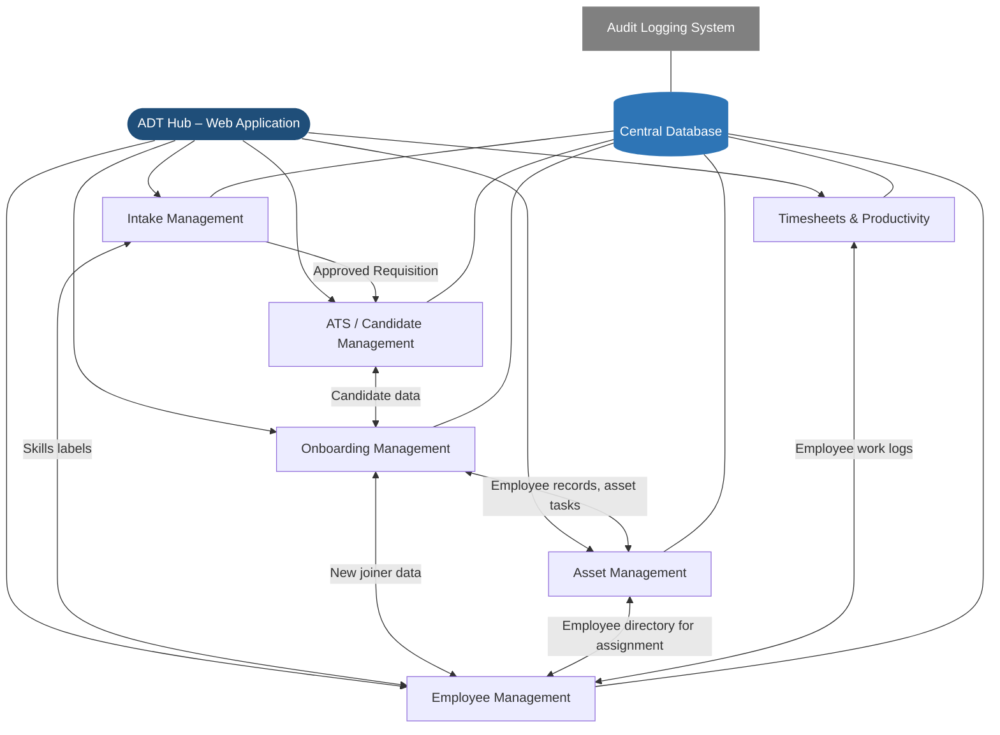
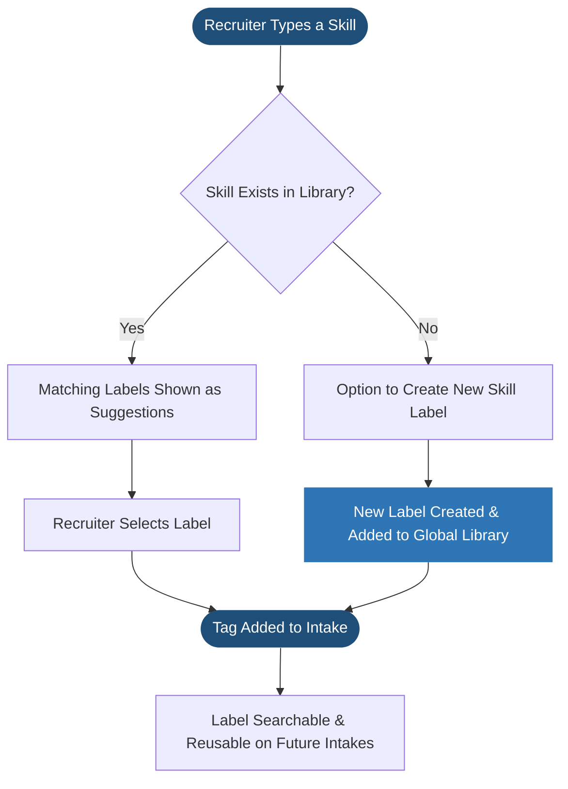
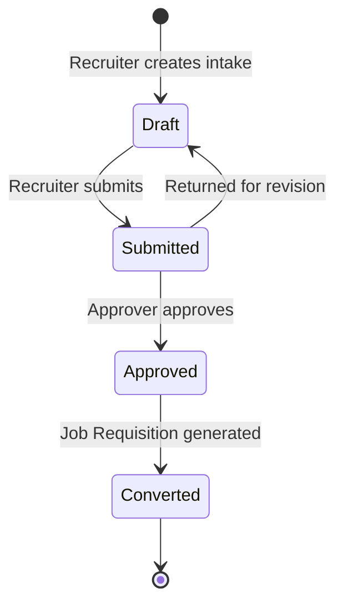
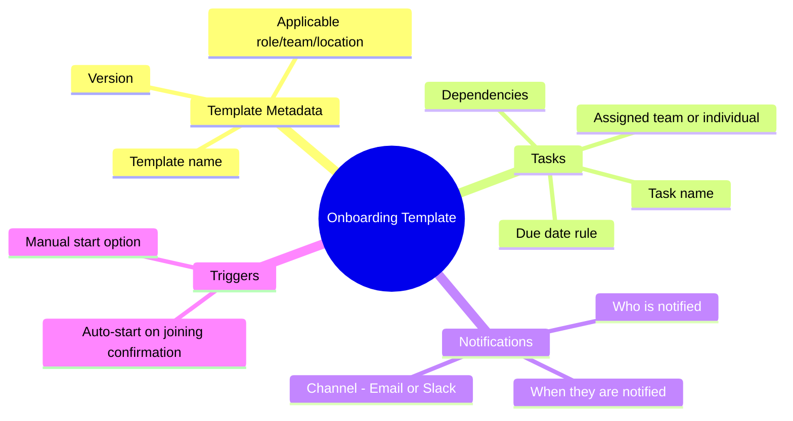
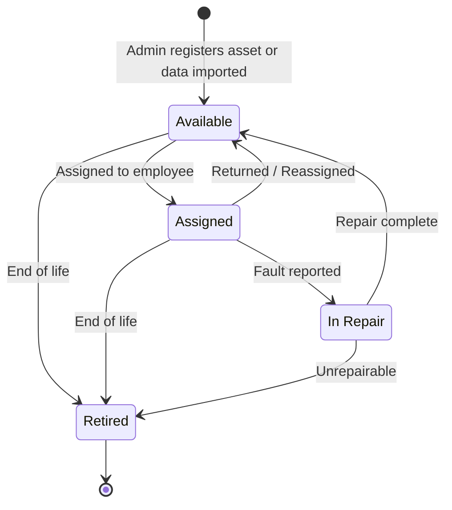
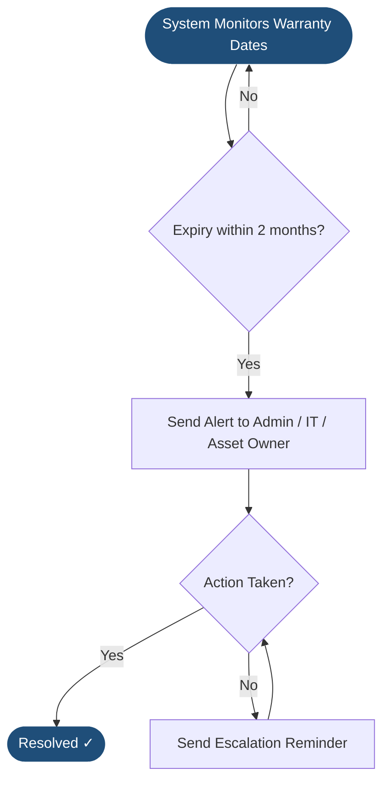
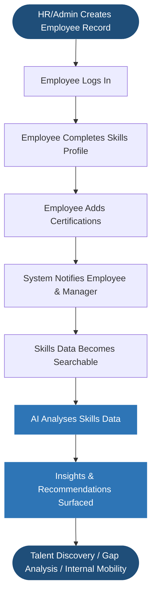
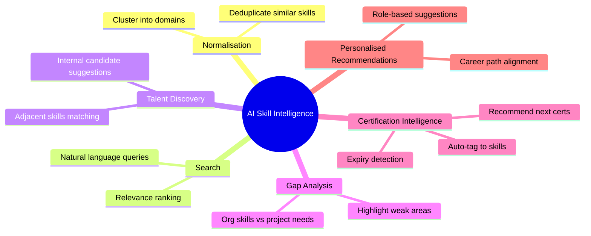
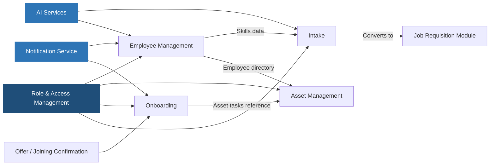

# ADT Hub – Product Specification Plan

**Version:** 1.0 – Initial Draft  
**Date:** March 2026  
**Modules:** Intake · ATS · Onboarding · Assets · Employees · Timesheets

---

## Document Overview

This Specification Plan defines the functional scope, objectives, user flows, and requirements for four core modules of ADT Hub. It is intended to align product, engineering, and business stakeholders before detailed design and development begins.

### Application Architecture

ADT Hub is a web application. Each module is a dedicated section of the application with its own pages, accessible via a shared navigation. All modules store and retrieve data from a central database, and modules are connected to each other — meaning data created in one module (such as an employee record) can be referenced and used in another (such as assigning that employee an asset or including them in an onboarding workflow).

Each module also supports connections to external services where relevant — such as email notifications, AI generation, and importing data from external sources — without requiring users to leave the application.

### Module Summary

| Module | Purpose | Primary Users |
|---|---|---|
| Intake Management | Capture and approve hiring requirements; auto-generate job requisitions and JDs | Recruiters, Hiring Managers, Admins |
| ATS / Candidate Management | Manage candidates, parse resumes, filter talent, and track interview feedback | Recruiters, Interviewers, Hiring Managers |
| Onboarding Management | Orchestrate cross-team onboarding tasks for new joiners from offer acceptance to Day-1 | Recruiters, HR, IT, Admin, Hiring Managers |
| Asset Management | Register, assign, and track company assets throughout their full lifecycle | Admins, IT, HR |
| Employee Management | Manage employee records and self-service skills/certifications with AI-powered insights | HR, Admins, Employees, Managers |
| Timesheets & Productivity | Track employee work hours against projects with billable/non-billable logic | Employees, Managers, Finance |
| Audit Logging | System-wide immutable record of all data changes and user actions | Admins, Compliance |

---

## Epic 1 – Intake Management

### Overview
The Intake Management module is a dedicated section of the ADT Hub web application and serves as the starting point of the hiring lifecycle. It allows recruiters to capture structured hiring information through an online form and automatically generates a Job Requisition and a draft Job Description upon approval. Data entered here is stored centrally and connects to the Employee Management module for skills data.

### Business Objectives
- Reduce time to create and approve job requisitions
- Improve quality and consistency of job descriptions
- Create a single source of truth for hiring requirements
- Enable scalable hiring processes as the organisation grows

### Scope
**In Scope**
- Intake form creation and management
- Structured data capture (budget, location, skills, role level, employment type, business context)
- Skill tagging with smart label creation and reuse
- Validation of mandatory fields
- Conversion of intake into Job Requisition
- AI-assisted JD generation based on intake data and existing JD formats
- AI-generated intake summary saved to the intake record and emailed to hiring managers
- Status tracking: Draft → Submitted → Approved → Converted

### Key Features
| Feature | Description |
|---|---|
| Configurable Intake Form | Form fields can be tailored by Admin to reflect organisation needs |
| Skill Tagging | Type a skill to search existing labels; select a match to add it as a tag, or create a new label if it doesn't exist. All labels are searchable and reusable across future intake forms |
| Role-Based Access | Recruiter, Hiring Manager, and Admin roles with appropriate permissions |
| Approval Workflow | Optional and configurable approval step before intake is converted |
| AI JD Generation | System generates a draft JD using predefined templates and existing JD formats |
| AI Intake Summary | AI generates a contextual summary of the intake form in the style of a job description. The summary is saved to the intake record and can be sent directly to the hiring manager via email |
| Audit Trail | Version history and change log for each intake record |
| Downstream Integration | Seamless handoff to the Job Requisition module upon approval |

### Skill Tagging – Behaviour

### AI Intake Summary – Flow

### User Flow

### Status Lifecycle

### Acceptance Criteria
- Recruiters can create and submit a complete intake form
- Mandatory fields are validated before submission
- Skills can be typed and matched against the existing label library; new labels can be created and are immediately available for reuse
- All skill labels are searchable and filterable across intake records
- Approval workflow routes intake to the correct approver (where configured)
- Job Requisition is auto-created upon approval
- Draft JD is generated in the existing organisation format using AI
- AI-generated intake summary is saved to the intake record
- Summary can be emailed to the hiring manager directly from the intake
- All intake records include a full audit trail and version history

---

## Epic 2 – ATS / Candidate Management

### Overview
Automates candidate intake and tracking. It focuses on reducing manual data entry via intelligent resume parsing and providing a central hub for candidate evaluation.

### Key Features
| Feature | Description |
|---|---|
| AI Resume Parsing | Automatically extract Name, Email, Phone, and LinkedIn URLs from uploaded CVs (PDF/Text) |
| Candidate Kanban | Drag-and-drop interface for moving candidates through hiring stages |
| Advanced Filtering | Filter candidates by skills, proficiency, and application date |
| Interview Feedback | Structured feedback tabs for interviewers to log ratings and comments |
| Interview Activity Timeline | Real-time log of all candidate-related actions and communications |

### Logic Contracts (from ADTHUB)
- **Name Extraction:** Multi-strategy fallback (Line 1-5, Title Case check, ALL CAPS normalisation, Email local-part derivation).
- **Phone Extraction:** Supports international formats, 10-digit US, and parentheses while excluding years (e.g., "2024").

---

## Epic 2 – Onboarding Management

### Overview

The Onboarding Management module is a dedicated section of the ADT Hub web application. It enables structured, dependency-driven onboarding workflows for new joiners from the moment an offer is accepted. It coordinates tasks across HR, IT, Admin, Finance, and Hiring Teams, drawing on data from the Employee Management and Asset Management modules to ensure every new hire is fully onboarded on time.

### Business Objectives

- Ensure consistent and error-free onboarding for every new joiner
- Reduce Day-1 productivity gaps caused by incomplete setup
- Eliminate manual coordination and follow-up across teams
- Provide real-time visibility and accountability across all onboarding tasks
- Scale onboarding efficiently as hiring volume increases

### Scope

**In Scope**
- Onboarding workflow initiation from offer/joining confirmation
- Task and dependent task orchestration across teams
- Cross-team task ownership and assignment
- Configurable onboarding templates defining tasks, owners, dependencies, and notifications
- Status tracking and SLA monitoring
- Automated notifications and reminders
- Central onboarding dashboard for all stakeholders

**Out of Scope**
- Offboarding workflows
- Payroll processing
- Performance management
- Learning and development content delivery

### User Flow

### Task Dependency Map

### Key Features

| Feature | Description |
|---|---|
| Workflow Template Builder | Admins can create and manage named onboarding templates (e.g. "New Employee – Engineering"). Each template defines the full set of tasks, assigned teams, due date rules, dependencies, and who gets notified at each step |
| Template Versioning | Templates can be updated without affecting in-progress onboardings; new onboardings always use the latest version |
| Task Dependency Management | Dependent tasks triggered only after prerequisite completion |
| Multi-Team Assignment | Tasks auto-assigned to IT, HR, Admin, Finance as appropriate |
| SLA Enforcement | Due dates tracked; overdue tasks escalated automatically |
| Real-Time Dashboard | All stakeholders view live onboarding progress per new joiner |
| Audit Trail | Full activity log with timestamps for compliance |

### Template Structure

Each onboarding template defines:

### Roles & Permissions

| Role | Access |
|---|---|
| Admin | Configure workflows, templates, and task dependencies |
| Recruiter | Initiate onboarding and track overall progress |
| Task Owner (IT/HR/Admin) | View and complete assigned tasks |
| Hiring Manager | View onboarding status for their new joiners |

### Acceptance Criteria

- Admins can create, edit, and version onboarding workflow templates
- Templates define tasks, team assignments, due date rules, dependencies, and notification rules
- Recruiters can initiate onboarding for a confirmed new joiner using a selected template
- Tasks are automatically created and assigned based on the template
- Dependent tasks are triggered only after prerequisite completion
- Notification rules in the template control who is alerted and when
- All stakeholders can view real-time onboarding status
- Notifications are sent for pending and overdue tasks

### Success Metrics

- % of onboarding tasks completed before Day-1
- Reduction in onboarding delays
- Average onboarding completion time
- New joiner satisfaction score
- Reduction in manual follow-ups by recruiters

---

## Epic 3 – Asset Management

### Overview

The Asset Management module is a dedicated section of the ADT Hub web application and acts as the system of record for all company-owned assets. Admins can register assets, assign them to employees using data from the Employee Management module, and track their full lifecycle. The module also supports importing asset data from external sources and attaching invoices for verification, with all records stored centrally and linked to employee profiles.

### Business Objectives

- Maintain a single, reliable source of truth for all company assets
- Ensure complete asset traceability and audit compliance
- Reduce asset loss and mismanagement
- Enable proactive warranty and replacement planning
- Improve onboarding efficiency through faster asset assignment

### Scope

**In Scope**
- Asset registration and master data management
- Asset assignment and reassignment via Employee Management integration
- Dedicated asset detail page per asset record
- Immutable asset records (non-deletable; status changes only)
- Search and filter across all asset records
- Automated warranty expiry notifications
- Bulk asset import from external data sources with configurable field-matching criteria
- Invoice attachment and asset-to-invoice verification

**Out of Scope**
- Asset procurement workflows and vendor payments
- Asset depreciation and accounting
- Asset disposal approval workflows

### Asset Lifecycle

### Warranty Alert Flow

### Key Features

| Feature | Description |
|---|---|
| Asset Registration | Capture all asset details upon procurement |
| Asset Detail Page | Dedicated page per asset with full history, status, invoices, and assignment records |
| Employee Assignment via Employee Management | Assets are assigned by searching and selecting from the Employee Management directory. The asset record links directly to the employee profile |
| Immutable Records | Assets cannot be deleted; status transitions replace deletions |
| Lifecycle Tracking | Statuses: Available, Assigned, In Repair, Retired |
| Global Search & Filters | Search by category, status, employee, serial number, etc. |
| Warranty Alerts | Automated alerts 2 months before expiry with escalation reminders |
| Bulk External Data Import | Import asset records from an external data file. The system applies configurable field-matching criteria to determine which entries to bring in, skipping any that don't meet the required criteria. A preview is shown before records are created |
| Invoice Attachment & Verification | Upload invoices to an asset record. System allows matching the invoice to the asset as a verification step, confirming procurement and supporting audit compliance |

### Employee Assignment Flow

### External Data Import Flow

**Import matching criteria are configurable by Admin** and define which fields must be present and valid for a record to be accepted into the system.

### Invoice Attachment & Verification Flow

### Asset Data Captured

| Field | Details |
|---|---|
| Asset Category | Laptop, Headphones, Monitor, Peripherals, etc. |
| Manufacturer & Model | Free text |
| Serial Number / Asset Tag | Unique identifier |
| Procurement Date | Date of purchase |
| Vendor | Optional |
| Warranty Start & End Date | Used for automated alerts |
| Warranty Type | Standard / Extended |
| Current Status | Available / Assigned / In Repair / Retired |
| Assigned Employee | Linked from Employee Management directory; current and historical |
| Location | Office / Remote / Warehouse |
| Invoice Attachments | Uploaded invoices with verification status (Unverified / Verified / Mismatch) |
| Import Source | Populated if record was created via external data import; includes import date |
| Notes & Attachments | Warranty documents and general notes |

### Acceptance Criteria

- Admins can create asset records for newly procured assets
- Assets can be assigned by searching the Employee Management directory
- Asset records cannot be deleted once created
- All asset updates are logged with timestamps and user details
- Assets can be assigned and reassigned to employees
- Asset detail page displays complete asset history including assignments and invoices
- All records are searchable and filterable
- System sends automated warranty alerts 2 months in advance
- Admins can upload an external data file; system applies matching criteria and presents a preview before creating records
- Skipped rows from import are logged with a reason
- Invoices can be attached to asset records and verified against asset details
- Mismatched invoices are flagged for admin review

### Success Metrics

- % of assets accurately tracked in the system
- Reduction in missing or unaccounted assets
- % of warranty expiries proactively addressed
- Reduction in onboarding delays due to asset unavailability

---

## Epic 4 – Employee Management

### Overview

The Employee Management module is a dedicated section of the ADT Hub web application and serves as the central employee record for the platform. It enables HR and Admins to manage employee profiles, and allows employees to maintain their own skills and certifications. The data stored here is shared across other modules — employee records are used in Onboarding to manage new joiner tasks, in Asset Management for assigning equipment, and in Intake to connect skills to hiring requirements.

### Business Objectives

- Maintain a single source of truth for all employee data
- Enable skills-based staffing and internal mobility
- Improve workforce planning and capability visibility
- Encourage continuous learning and certification tracking
- Use AI to surface hidden talent and identify skill gaps

### Scope

**In Scope**
- Employee master record management (HR/Admin managed)
- Employee self-service skills and certification capture
- Organisation-wide skills search and reporting
- Certification notifications to employees and managers
- AI-driven skill insights and recommendations

**Out of Scope**
- Payroll and compensation processing
- Performance appraisal workflows
- External LMS integration

### User Flow

### AI Capabilities Map

### Key Features

| Feature | Description |
|---|---|
| Unified Employee Profile | Single page for all employment details, managed by HR/Admin |
| Self-Service Skills Page | Employee-managed skills and certifications profile |
| Organisation Skills Directory | Searchable directory of all employee skills |
| Skills Search & Reporting | Filter and report by skill, proficiency, team, and more |
| Certification Notifications | Notify employee and manager when cert is added or nearing expiry |
| AI Skill Insights | AI-powered talent discovery, gap analysis, and recommendations |

### Roles & Permissions

| Role | Access |
|---|---|
| Admin | Full access to all employee data and reports |
| HR | Create and manage employee records |
| Employee | Edit own skills and certifications only |
| Manager | View team skills and receive certification notifications |

### Acceptance Criteria

- HR/Admin can create and update employee records on a single page
- Employees can add and update skills and certifications independently
- Skills data is searchable and reportable across the organisation
- Notifications are sent when certifications are added
- AI features provide actionable insights and recommendations
- Role-based access is enforced across all data

### Success Metrics

- % of employees with completed skills profiles
- Average time to find skilled internal resources
- Reduction in external hiring for roles fillable internally
- Increase in certification adoption
- Manager satisfaction with skills visibility

---

## Epic 6 – Timesheets & Productivity

### Overview
A streamlined module for employees to log working hours against specific projects, ensuring accurate project costing and billable hour tracking.

### Key Features
| Feature | Description |
|---|---|
| Weekly Timesheet Entry | Monday-to-Sunday grid views with project selection |
| Billable Tracking | Default-on billable toggle for each time entry |
| CSV Export | Finance-ready double-quoted CSV generation including Date, Project, Hours, Notes, and Status |
| Validation Rules | Prevents submission of weekend entries or entries with missing project/hours |
| RBAC Controls | Admins can edit/delete any record; Employees limited to their own Draft/Rejected records |

### Logic Contracts (from ADTHUB)
- **Current Week Calculation:** Sunday-correction logic (Sunday belongs to the ending week).
- **CSV Format:** 6-column structure: `Date, Project, Hours, Notes, Status, Employee`.

---

## Epic 7 – System Audit Logging

### Overview
A foundational system service that records every Create, Update, and Delete action across the platform for compliance and integrity.

### Key Features
| Feature | Description |
|---|---|
| Invariant Logging | Every asset or employee change triggers an automatic `audit_logs` entry |
| Diff Capture | Stores `old_value` and `new_value` as JSON strings to track specific field changes |
| User Attribution | Every log entry is permanently linked to the `user_id` of the performer |
| Immutable History | Audit logs are read-only and cannot be modified or deleted by any user level |

---

## Appendix – Cross-Module Connections

Each module in ADT Hub is a webpage within the same web application. They share a central database and reference each other's data where relevant. The diagram below shows the key connections between modules and the external services the application relies on.

| Module | Connected To | How They Connect |
|---|---|---|
| Intake | Employee Management | Skills labels from the global library are shared across both modules |
| Intake | Job Requisition Module | An approved intake automatically creates a Job Requisition |
| Onboarding | Employee Management | New joiner data is pulled from employee records to initiate workflows |
| Onboarding | Asset Management | Asset assignment tasks within onboarding reference the Asset module |
| Onboarding | Notification Service | Task alerts and reminders are sent via email or messaging |
| Asset Management | Employee Management | Employee directory is used to search and assign assets to people |
| Employee Management | Notification Service | Certification alerts are sent via email or messaging |
| Employee Management | AI Services | AI skill features draw on employee skills and certification data |
| Intake | AI Services | AI JD generation and intake summary use intake form data |
| All Modules | Role & Access Management | User roles and permissions are enforced across the entire application |

---

## Appendix – Stakeholders

| Stakeholder | Relevant Modules |
|---|---|
| HR Operations | Intake, Onboarding, Employee Management |
| Recruiting Team | Intake, Onboarding |
| IT / Infrastructure | Onboarding, Asset Management |
| Admin & Facilities | Onboarding, Asset Management |
| Hiring Managers | Intake, Onboarding, Employee Management |
| Finance / Compliance | Intake, Onboarding |
| Talent Management | Employee Management |
| Employees | Employee Management |
| Leadership | Asset Management, Employee Management |
